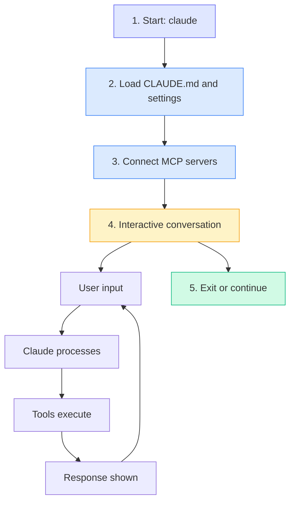

# CLI Overview

Claude Code's command-line interface is where you interact with Claude for coding tasks. This overview covers the main concepts and usage patterns.

## Basic Usage

### Interactive Mode

Start an interactive session:

```bash
claude
```

This opens a REPL where you can have a conversation with Claude about your code.

### One-Shot Mode

Execute a single command and exit:

```bash
claude "your request here"
```

### Headless Mode

For scripts and CI/CD pipelines:

```bash
claude -p "your prompt" --json
```

## Command Structure

```bash
claude [options] [prompt]
```

### Common Options

| Option | Description |
|--------|-------------|
| `-c, --continue` | Resume last conversation |
| `-p, --print` | Headless mode (non-interactive) |
| `--model <model>` | Specify Claude model |
| `--json` | JSON output format |
| `--verbose` | Detailed logging |
| `--mcp-debug` | Debug MCP connections |

## Session Flow



## Context and Memory

### Session Context

Claude maintains context throughout a session:
- All messages and responses
- File contents read
- Tool outputs
- User preferences

### CLAUDE.md Memory

Project-specific memory stored in CLAUDE.md:
- Project structure notes
- Common commands
- Coding conventions
- Important information to remember

### Context Management

Monitor and manage context usage:

```bash
/context    # View current usage
/compact    # Compress to save space
/clear      # Start fresh
```

## Working Directory

Claude Code operates in your current directory:

```bash
cd my-project
claude
```

Claude has access to:
- Files in the current directory
- Git repository information
- Package manager files
- Configuration files

## Model Selection

Switch models based on your needs:

```bash
# Start with a specific model
claude --model claude-opus-4-5-20251101

# Switch during session
/model sonnet
```

## Output Modes

### Interactive (Default)

Rich terminal UI with:
- Colored output
- Progress indicators
- Diff previews
- Approval prompts

### JSON Mode

Structured output for parsing:

```bash
claude -p "query" --json
```

### Stream Mode

Real-time output for long operations:

```bash
claude -p "query" --output-format stream-json
```

## Integration Points

The CLI integrates with:

- **Git** - Understands repository context
- **Package managers** - npm, pip, cargo, etc.
- **Build tools** - Webpack, Vite, etc.
- **Test frameworks** - Jest, pytest, etc.
- **MCP servers** - External tools and APIs

## Next Steps

- [Learn all commands](/cli/commands)
- [Explore slash commands](/cli/slash-commands)
- [Configure settings](/cli/configuration)
