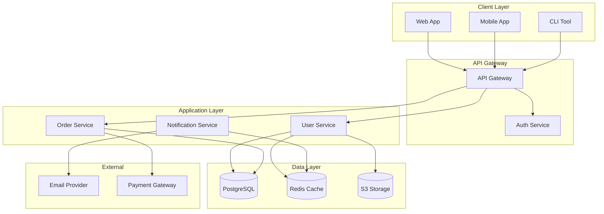
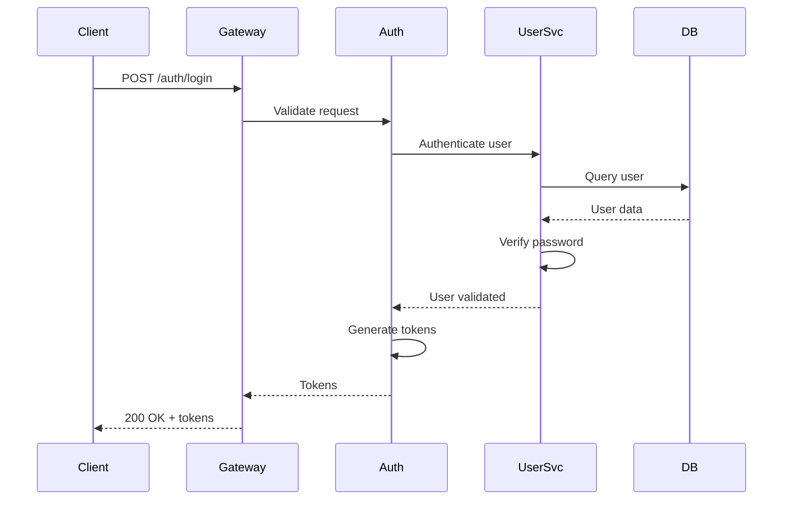
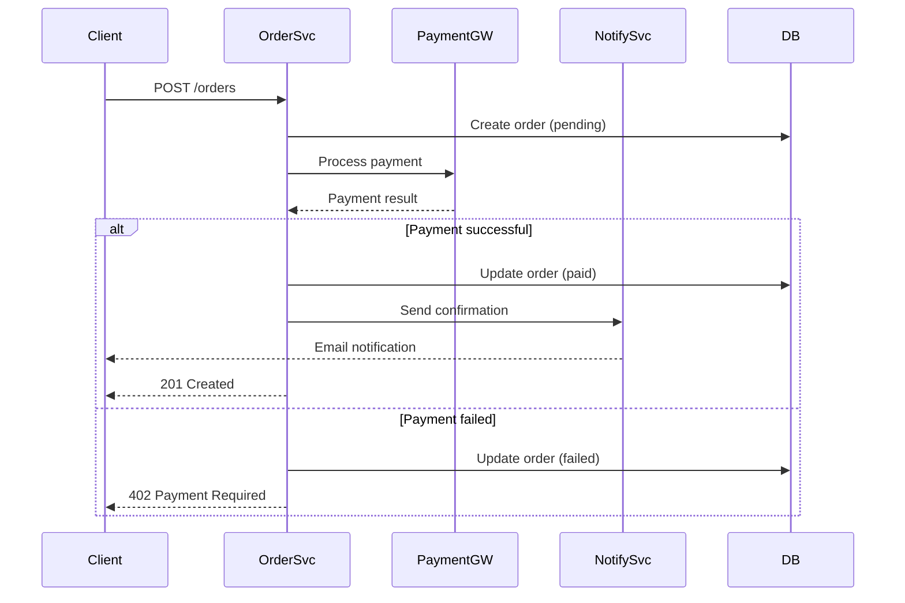
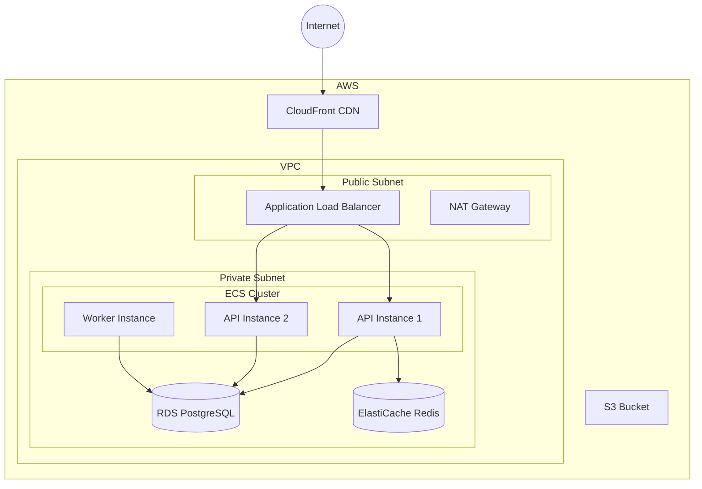

# Documentation Generation

Leverage Claude Code to create and maintain high-quality documentation across your projects.

## README Generation

### Project README

```text title="Generate Complete README"
> Generate a comprehensive README.md for this project including:
> - Project description
> - Installation instructions
> - Usage examples
> - Configuration options
> - Contributing guidelines
```

Claude analyzes your codebase and generates:

```markdown title="README.md"
# Project Name

Brief, compelling description of what the project does and why it matters.

## Features

- Feature 1: Description
- Feature 2: Description
- Feature 3: Description

## Quick Start

```bash
# Install dependencies
npm install

# Configure environment
cp .env.example .env

# Run development server
npm run dev
```

## Installation

### Prerequisites

- Node.js 18+
- PostgreSQL 15+
- Redis (optional, for caching)

### Steps

1. Clone the repository
   ```bash
   git clone https://github.com/org/project.git
   cd project
   ```

2. Install dependencies
   ```bash
   npm install
   ```

3. Set up the database
   ```bash
   npm run db:setup
   ```

4. Start the development server
   ```bash
   npm run dev
   ```

## Configuration

| Variable | Description | Default |
|----------|-------------|---------|
| `PORT` | Server port | `3000` |
| `DATABASE_URL` | PostgreSQL connection string | Required |
| `JWT_SECRET` | Secret for JWT signing | Required |

## Usage

### Basic Example

```typescript
import { Client } from 'project-name';

const client = new Client({
  apiKey: process.env.API_KEY,
});

const result = await client.doSomething();
```

### Advanced Usage

[Link to full documentation]

## API Reference

See [API Documentation](./docs/api.md) for complete reference.

## Contributing

See [CONTRIBUTING.md](./CONTRIBUTING.md) for contribution guidelines.

## License

MIT - see [LICENSE](./LICENSE)
```

### README Update Script

```bash title="scripts/update-readme.sh"
#!/bin/bash
# Update README with current project state

# Get project info
PACKAGE_JSON=$(cat package.json)
DEPS=$(echo "$PACKAGE_JSON" | jq -r '.dependencies | keys[]' | head -10)
SCRIPTS=$(echo "$PACKAGE_JSON" | jq -r '.scripts | to_entries[] | "- `npm run \(.key)`: \(.value)"' | head -10)

# Get structure
STRUCTURE=$(find src -type f -name "*.ts" | head -20 | sort)

# Get existing README
CURRENT_README=$(cat README.md 2>/dev/null || echo "")

claude -p "Update this README based on the current project state:

**Current README:**
$CURRENT_README

**Package.json:**
$PACKAGE_JSON

**Key dependencies:**
$DEPS

**Available scripts:**
$SCRIPTS

**Source structure:**
$STRUCTURE

Update the README to:
1. Reflect current features
2. Update installation instructions if needed
3. Add any missing npm scripts
4. Keep existing custom sections
5. Improve clarity where possible

Return the complete updated README."
```

### Badge Generation

```text title="Add Status Badges"
> Add appropriate badges to the README for:
> - Build status (GitHub Actions)
> - Test coverage
> - npm version
> - License
> - TypeScript
```

```markdown title="Badge Examples"


```

## API Documentation

### OpenAPI/Swagger Generation

```text title="Generate OpenAPI Spec"
> Analyze the API routes in src/api/ and generate an OpenAPI 3.0 specification
```

```yaml title="openapi.yaml"
openapi: 3.0.3
info:
  title: Project API
  description: RESTful API for Project
  version: 1.0.0
  contact:
    email: api@example.com

servers:
  - url: https://api.example.com/v1
    description: Production
  - url: http://localhost:3000/v1
    description: Development

paths:
  /users:
    get:
      summary: List all users
      description: Returns a paginated list of users
      operationId: listUsers
      tags:
        - Users
      parameters:
        - name: page
          in: query
          schema:
            type: integer
            default: 1
        - name: limit
          in: query
          schema:
            type: integer
            default: 20
            maximum: 100
      responses:
        '200':
          description: Successful response
          content:
            application/json:
              schema:
                type: object
                properties:
                  data:
                    type: array
                    items:
                      $ref: '#/components/schemas/User'
                  pagination:
                    $ref: '#/components/schemas/Pagination'
        '401':
          $ref: '#/components/responses/Unauthorized'

    post:
      summary: Create a new user
      operationId: createUser
      tags:
        - Users
      requestBody:
        required: true
        content:
          application/json:
            schema:
              $ref: '#/components/schemas/CreateUserRequest'
      responses:
        '201':
          description: User created
          content:
            application/json:
              schema:
                $ref: '#/components/schemas/User'
        '400':
          $ref: '#/components/responses/BadRequest'
        '409':
          description: Email already exists

  /users/{id}:
    get:
      summary: Get user by ID
      operationId: getUserById
      tags:
        - Users
      parameters:
        - name: id
          in: path
          required: true
          schema:
            type: string
            format: uuid
      responses:
        '200':
          description: Successful response
          content:
            application/json:
              schema:
                $ref: '#/components/schemas/User'
        '404':
          $ref: '#/components/responses/NotFound'

components:
  schemas:
    User:
      type: object
      properties:
        id:
          type: string
          format: uuid
        email:
          type: string
          format: email
        name:
          type: string
        createdAt:
          type: string
          format: date-time
      required:
        - id
        - email
        - name

    CreateUserRequest:
      type: object
      properties:
        email:
          type: string
          format: email
        password:
          type: string
          minLength: 8
        name:
          type: string
      required:
        - email
        - password
        - name

    Pagination:
      type: object
      properties:
        page:
          type: integer
        limit:
          type: integer
        total:
          type: integer
        totalPages:
          type: integer

  responses:
    BadRequest:
      description: Invalid request
      content:
        application/json:
          schema:
            type: object
            properties:
              error:
                type: string
              details:
                type: array
                items:
                  type: object

    Unauthorized:
      description: Authentication required
      content:
        application/json:
          schema:
            type: object
            properties:
              error:
                type: string
                example: Unauthorized

    NotFound:
      description: Resource not found
      content:
        application/json:
          schema:
            type: object
            properties:
              error:
                type: string
                example: Not found

  securitySchemes:
    bearerAuth:
      type: http
      scheme: bearer
      bearerFormat: JWT

security:
  - bearerAuth: []
```

### API Documentation Automation

```bash title="scripts/generate-api-docs.sh"
#!/bin/bash
# Generate API documentation from code

# Find all route files
ROUTES=$(find src/api -name "*.ts" -type f)

# Collect route information
ROUTE_INFO=""
for FILE in $ROUTES; do
  CONTENT=$(cat "$FILE")
  ROUTE_INFO="$ROUTE_INFO

=== $FILE ===
$CONTENT"
done

# Generate documentation
claude -p "Generate API documentation from these route files:

$ROUTE_INFO

Create comprehensive API docs including:
1. Endpoint summary table
2. Detailed endpoint documentation
3. Request/response examples
4. Error codes
5. Authentication requirements

Format as Markdown suitable for a docs site." > docs/api.md

echo "API documentation generated: docs/api.md"
```

### Endpoint Documentation Template

```markdown title="docs/api/users.md"
# Users API

## Overview

The Users API allows you to manage user accounts.

## Endpoints

| Method | Endpoint | Description |
|--------|----------|-------------|
| GET | `/users` | List all users |
| POST | `/users` | Create a new user |
| GET | `/users/:id` | Get user by ID |
| PUT | `/users/:id` | Update user |
| DELETE | `/users/:id` | Delete user |

## List Users

```http
GET /api/v1/users
```

### Query Parameters

| Parameter | Type | Default | Description |
|-----------|------|---------|-------------|
| page | integer | 1 | Page number |
| limit | integer | 20 | Items per page (max 100) |
| sort | string | createdAt | Sort field |
| order | string | desc | Sort order (asc/desc) |

### Response

```json
{
  "data": [
    {
      "id": "123e4567-e89b-12d3-a456-426614174000",
      "email": "user@example.com",
      "name": "John Doe",
      "createdAt": "2024-01-15T10:30:00Z"
    }
  ],
  "pagination": {
    "page": 1,
    "limit": 20,
    "total": 150,
    "totalPages": 8
  }
}
```

### Example

```bash
curl -X GET "https://api.example.com/v1/users?page=1&limit=10" \
  -H "Authorization: Bearer YOUR_TOKEN"
```
```

## JSDoc/Docstring Generation

### TypeScript JSDoc

```text title="Add JSDoc Comments"
> Add comprehensive JSDoc comments to all exported functions and classes
> in src/services/UserService.ts
```

```typescript title="src/services/UserService.ts"
/**
 * Service for managing user accounts and authentication.
 *
 * @example
 * ```typescript
 * const userService = new UserService(userRepo, emailService);
 * const user = await userService.createUser({
 *   email: 'user@example.com',
 *   password: 'secure123',
 *   name: 'John Doe'
 * });
 * ```
 */
export class UserService {
  /**
   * Creates a new instance of UserService.
   *
   * @param userRepository - Repository for user data operations
   * @param emailService - Service for sending emails
   */
  constructor(
    private readonly userRepository: UserRepository,
    private readonly emailService: EmailService
  ) {}

  /**
   * Creates a new user account.
   *
   * @param data - User creation data
   * @param data.email - User's email address (must be unique)
   * @param data.password - Password (min 8 characters)
   * @param data.name - User's display name
   * @returns The created user object
   * @throws {ValidationError} If email format is invalid
   * @throws {ConflictError} If email already exists
   *
   * @example
   * ```typescript
   * const user = await userService.createUser({
   *   email: 'new@example.com',
   *   password: 'SecurePass123!',
   *   name: 'Jane Doe'
   * });
   * console.log(user.id); // Generated UUID
   * ```
   */
  async createUser(data: CreateUserInput): Promise<User> {
    // Implementation
  }

  /**
   * Finds a user by their unique identifier.
   *
   * @param id - User's UUID
   * @returns The user if found, null otherwise
   *
   * @example
   * ```typescript
   * const user = await userService.findById('123e4567-e89b-12d3-a456-426614174000');
   * if (user) {
   *   console.log(user.email);
   * }
   * ```
   */
  async findById(id: string): Promise<User | null> {
    // Implementation
  }

  /**
   * Authenticates a user with email and password.
   *
   * @param email - User's email address
   * @param password - User's password
   * @returns Authentication tokens if successful
   * @throws {AuthenticationError} If credentials are invalid
   *
   * @example
   * ```typescript
   * try {
   *   const { token, refreshToken } = await userService.authenticate(
   *     'user@example.com',
   *     'password123'
   *   );
   * } catch (error) {
   *   if (error instanceof AuthenticationError) {
   *     console.log('Invalid credentials');
   *   }
   * }
   * ```
   */
  async authenticate(email: string, password: string): Promise<AuthTokens> {
    // Implementation
  }
}
```

### Python Docstrings

```text title="Add Python Docstrings"
> Add Google-style docstrings to all functions and classes in src/services/
```

```python title="src/services/user_service.py"
"""User management service module.

This module provides functionality for managing user accounts,
authentication, and related operations.

Example:
    Basic usage::

        from services.user_service import UserService

        service = UserService(user_repo, email_service)
        user = await service.create_user(
            email="user@example.com",
            password="secure123",
            name="John Doe"
        )
"""

from typing import Optional
from models import User, CreateUserInput, AuthTokens


class UserService:
    """Service for managing user accounts and authentication.

    This service handles user creation, authentication, and account
    management operations.

    Attributes:
        user_repository: Repository for user data persistence.
        email_service: Service for sending transactional emails.

    Example:
        >>> service = UserService(repo, email)
        >>> user = await service.create_user(
        ...     email="test@example.com",
        ...     password="secure123",
        ...     name="Test User"
        ... )
        >>> print(user.id)
        '123e4567-e89b-12d3-a456-426614174000'
    """

    def __init__(
        self,
        user_repository: UserRepository,
        email_service: EmailService
    ) -> None:
        """Initialize UserService with dependencies.

        Args:
            user_repository: Repository for user data operations.
            email_service: Service for sending emails.
        """
        self.user_repository = user_repository
        self.email_service = email_service

    async def create_user(self, data: CreateUserInput) -> User:
        """Create a new user account.

        Creates a new user with the provided information, hashes the
        password, and sends a welcome email.

        Args:
            data: User creation input containing:
                - email: User's email address (must be unique)
                - password: Password (minimum 8 characters)
                - name: User's display name

        Returns:
            The newly created User object with generated ID.

        Raises:
            ValidationError: If email format is invalid or password
                is too weak.
            ConflictError: If a user with the email already exists.

        Example:
            >>> user = await service.create_user(CreateUserInput(
            ...     email="new@example.com",
            ...     password="SecurePass123!",
            ...     name="New User"
            ... ))
            >>> print(user.email)
            'new@example.com'
        """
        pass  # Implementation

    async def find_by_id(self, user_id: str) -> Optional[User]:
        """Find a user by their unique identifier.

        Args:
            user_id: The user's UUID string.

        Returns:
            The User object if found, None otherwise.

        Example:
            >>> user = await service.find_by_id("123e4567-...")
            >>> if user:
            ...     print(user.name)
        """
        pass  # Implementation

    async def authenticate(
        self,
        email: str,
        password: str
    ) -> AuthTokens:
        """Authenticate a user with credentials.

        Verifies the user's email and password, and returns
        authentication tokens if successful.

        Args:
            email: User's email address.
            password: User's password.

        Returns:
            AuthTokens containing access and refresh tokens.

        Raises:
            AuthenticationError: If credentials are invalid.
            UserNotFoundError: If no user exists with the email.

        Example:
            >>> tokens = await service.authenticate(
            ...     "user@example.com",
            ...     "password123"
            ... )
            >>> print(tokens.access_token)
        """
        pass  # Implementation
```

### Bulk Documentation Script

```bash title="scripts/add-docs.sh"
#!/bin/bash
# Add documentation to undocumented code

# Find files lacking documentation
UNDOCUMENTED=$(find src -name "*.ts" -exec grep -L "^\s*/\*\*" {} \;)

for FILE in $UNDOCUMENTED; do
  echo "Adding docs to: $FILE"

  CONTENT=$(cat "$FILE")

  DOCUMENTED=$(claude -p "Add comprehensive JSDoc comments to this TypeScript file:

$CONTENT

Requirements:
- Add JSDoc to all exported functions, classes, and interfaces
- Include @param, @returns, @throws, and @example where appropriate
- Keep existing code unchanged
- Use clear, professional language

Return the complete file with documentation added.")

  echo "$DOCUMENTED" > "$FILE"
done

echo "Documentation added to all files"
```

## Architecture Documentation

### System Architecture Doc

```text title="Generate Architecture Documentation"
> Analyze the codebase and generate architecture documentation including:
> - System overview
> - Component diagram (Mermaid)
> - Data flow
> - Dependencies
> - Deployment architecture
```

```markdown title="docs/architecture.md"
# System Architecture

## Overview

This document describes the high-level architecture of the application.

## System Components



## Component Details

### API Gateway

**Purpose**: Single entry point for all client requests

**Responsibilities**:
- Request routing
- Rate limiting
- Request/response logging
- CORS handling

**Technology**: Express.js with custom middleware

### User Service

**Purpose**: Manage user accounts and authentication

**Responsibilities**:
- User registration and authentication
- Profile management
- Session management
- Password reset flow

**Dependencies**:
- PostgreSQL for user data
- Redis for session storage
- S3 for profile images

### Order Service

**Purpose**: Handle order processing

**Dependencies**:
- PostgreSQL for order data
- Payment Gateway integration
- User Service for validation

## Data Flow

### Authentication Flow



### Order Processing Flow



## Deployment Architecture

### Production Environment



## Security Architecture

### Authentication

- JWT-based authentication
- Access tokens: 15-minute expiry
- Refresh tokens: 7-day expiry, stored in httpOnly cookies
- Token refresh happens automatically

### Authorization

- Role-based access control (RBAC)
- Roles: admin, user, guest
- Permission checks at service layer

### Data Protection

- All data encrypted at rest (AES-256)
- All traffic encrypted in transit (TLS 1.3)
- PII fields encrypted at application layer
- Regular security audits
```

### Architecture Update Automation

```bash title="scripts/update-architecture.sh"
#!/bin/bash
# Keep architecture docs in sync with code

# Analyze current structure
SERVICES=$(find src/services -name "*.ts" -exec basename {} .ts \;)
ROUTES=$(find src/api -name "*.ts" -exec basename {} .ts \;)
MODELS=$(find src/models -name "*.ts" -exec basename {} .ts \;)

# Get dependencies from package.json
DEPS=$(cat package.json | jq -r '.dependencies | keys[]')

# Get current architecture doc
CURRENT=$(cat docs/architecture.md 2>/dev/null || echo "")

claude -p "Update the architecture documentation:

**Current documentation:**
$CURRENT

**Services found:**
$SERVICES

**API routes:**
$ROUTES

**Data models:**
$MODELS

**Dependencies:**
$DEPS

Update the architecture doc to:
1. Add any new services/components
2. Update diagrams if structure changed
3. Keep existing valid content
4. Add any missing dependency documentation

Return the complete updated document." > docs/architecture.md
```

## Changelog Maintenance

### Automated Changelog

```bash title="scripts/generate-changelog.sh"
#!/bin/bash
# Generate changelog from commits

VERSION="${1:-Unreleased}"
SINCE="${2:-$(git describe --tags --abbrev=0 2>/dev/null || echo '')}"

if [ -n "$SINCE" ]; then
  COMMITS=$(git log "$SINCE"..HEAD --pretty=format:"%s|%h|%an" --no-merges)
else
  COMMITS=$(git log --pretty=format:"%s|%h|%an" --no-merges -100)
fi

ENTRY=$(claude -p "Generate a changelog entry from these commits:

Commits (format: message|hash|author):
$COMMITS

Version: $VERSION

Format as Keep a Changelog style:

## [$VERSION] - $(date +%Y-%m-%d)

### Added
- New features

### Changed
- Changes

### Fixed
- Bug fixes

### Security
- Security fixes

### Deprecated
- Deprecated features

### Removed
- Removed features

Rules:
- Group by type based on commit message prefix (feat, fix, etc.)
- Only include sections with entries
- Write user-friendly descriptions
- Include commit hashes as references")

# Update CHANGELOG.md
if [ -f CHANGELOG.md ]; then
  # Insert after header
  head -n 7 CHANGELOG.md > CHANGELOG.tmp
  echo "" >> CHANGELOG.tmp
  echo "$ENTRY" >> CHANGELOG.tmp
  echo "" >> CHANGELOG.tmp
  tail -n +8 CHANGELOG.md >> CHANGELOG.tmp
  mv CHANGELOG.tmp CHANGELOG.md
else
  echo "# Changelog

All notable changes to this project will be documented in this file.

The format is based on [Keep a Changelog](https://keepachangelog.com/en/1.0.0/).

$ENTRY" > CHANGELOG.md
fi

echo "Changelog updated for $VERSION"
```

### Release Notes Generation

```bash title="scripts/release-notes.sh"
#!/bin/bash
# Generate release notes for GitHub release

TAG="${1:?Tag required}"
PREV_TAG=$(git describe --tags --abbrev=0 "$TAG^" 2>/dev/null || echo "")

# Get commits
COMMITS=$(git log "$PREV_TAG".."$TAG" --pretty=format:"- %s (%h)" --no-merges)

# Get PRs if using GitHub
PRS=$(gh pr list --state merged --search "merged:>=$(git log -1 --format=%ci $PREV_TAG 2>/dev/null | cut -d' ' -f1)" --json number,title,labels --jq '.[] | "- #\(.number) \(.title)"' 2>/dev/null || echo "")

# Get contributors
CONTRIBUTORS=$(git log "$PREV_TAG".."$TAG" --format="%an" | sort -u)

claude -p "Generate release notes for $TAG:

**Commits:**
$COMMITS

**Pull Requests:**
$PRS

**Contributors:**
$CONTRIBUTORS

Create professional release notes with:

## Highlights
Key improvements in this release

## What's New
### Features
### Improvements
### Bug Fixes
### Security

## Breaking Changes
(if any)

## Upgrade Guide
(if needed)

## Contributors
Thank you to all contributors!

## Full Changelog
$PREV_TAG...$TAG"
```

## Migration Guides

### Generate Migration Guide

```text title="Create Migration Guide"
> Generate a migration guide from v1 to v2 based on the breaking changes
> in the changelog and API differences
```

```markdown title="docs/migration/v1-to-v2.md"
# Migration Guide: v1 to v2

This guide helps you upgrade from version 1.x to version 2.0.

## Overview

Version 2.0 includes several breaking changes to improve the API consistency
and add new features. This guide covers all changes you need to make.

## Breaking Changes

### Authentication API

#### Before (v1)
```typescript
// v1: Separate login method
const token = await auth.login(email, password);
```

#### After (v2)
```typescript
// v2: Unified authentication
const { accessToken, refreshToken } = await auth.authenticate({
  email,
  password,
});
```

**Migration steps:**
1. Update all `login()` calls to `authenticate()`
2. Destructure the response to get both tokens
3. Update token storage to handle refresh tokens

### User Model Changes

#### Schema Changes

| v1 Field | v2 Field | Notes |
|----------|----------|-------|
| `name` | `firstName`, `lastName` | Split into two fields |
| `role` | `roles` | Now an array |
| `created` | `createdAt` | Renamed for consistency |

#### Migration Script

```typescript
// Run this script to migrate user data
import { prisma } from './db';

async function migrateUsers() {
  const users = await prisma.user.findMany();

  for (const user of users) {
    const [firstName, ...rest] = user.name.split(' ');
    const lastName = rest.join(' ') || '';

    await prisma.user.update({
      where: { id: user.id },
      data: {
        firstName,
        lastName,
        roles: [user.role], // Convert to array
      },
    });
  }
}
```

### Configuration Changes

#### Environment Variables

| v1 Variable | v2 Variable | Notes |
|-------------|-------------|-------|
| `DB_URL` | `DATABASE_URL` | Renamed |
| `SECRET` | `JWT_SECRET` | More specific |
| - | `JWT_REFRESH_SECRET` | New in v2 |

### Removed Features

- `auth.legacyLogin()` - Use `auth.authenticate()` instead
- `user.getFullName()` - Use template literal with `firstName` and `lastName`
- XML response format - JSON only in v2

## Step-by-Step Migration

### 1. Update Dependencies

```bash
npm install your-package@^2.0.0
```

### 2. Update Configuration

```bash
# Update .env
mv DB_URL DATABASE_URL
mv SECRET JWT_SECRET
# Add new variable
echo "JWT_REFRESH_SECRET=$(openssl rand -hex 32)" >> .env
```

### 3. Run Database Migration

```bash
npm run migrate:v2
```

### 4. Update Code

Use the provided codemod:

```bash
npx your-package-codemod v1-to-v2 src/
```

### 5. Test

```bash
npm test
npm run test:e2e
```

## FAQ

### Q: Can I upgrade incrementally?

A: Yes, v2.0 includes a compatibility layer. Enable it with:
```typescript
import { enableV1Compat } from 'your-package';
enableV1Compat();
```
Note: This will be removed in v3.0.

### Q: What if I have custom authentication?

A: See the [Custom Auth Migration Guide](./custom-auth-migration.md).

## Getting Help

- [GitHub Discussions](https://github.com/org/repo/discussions)
- [Discord Server](https://discord.gg/yourserver)
- [Stack Overflow](https://stackoverflow.com/questions/tagged/your-package)
```

### Migration Script Generator

```bash title="scripts/generate-migration-guide.sh"
#!/bin/bash
# Generate migration guide between versions

FROM_VERSION="${1:?From version required}"
TO_VERSION="${2:?To version required}"

# Get breaking changes from changelog
BREAKING=$(sed -n "/## \[$TO_VERSION\]/,/## \[/p" CHANGELOG.md | grep -A 100 "Breaking Changes" | grep "^-")

# Compare API signatures
# (This would need actual comparison logic)
API_CHANGES="Compare src/api between versions"

claude -p "Generate a migration guide from v$FROM_VERSION to v$TO_VERSION:

**Breaking Changes from Changelog:**
$BREAKING

**API Changes:**
$API_CHANGES

Create a comprehensive migration guide including:
1. Overview of changes
2. Step-by-step migration instructions
3. Code examples (before/after)
4. Database migration scripts if needed
5. Configuration changes
6. FAQ section
7. Rollback instructions

Format as a professional documentation page." > "docs/migration/v${FROM_VERSION}-to-v${TO_VERSION}.md"
```

## Tutorial Creation

### Interactive Tutorial

```text title="Create Tutorial"
> Create a step-by-step tutorial for building a user authentication system
> with this library, suitable for beginners
```

```markdown title="docs/tutorials/authentication.md"
# Tutorial: Building User Authentication

In this tutorial, you'll learn how to implement a complete user authentication
system using our library.

## What You'll Build

- User registration
- Login with JWT
- Protected routes
- Password reset

## Prerequisites

- Node.js 18+
- Basic TypeScript knowledge
- A PostgreSQL database

## Time Required

Approximately 30 minutes

## Step 1: Project Setup

First, create a new project and install dependencies:

```bash
mkdir auth-tutorial
cd auth-tutorial
npm init -y
npm install express @your-lib/auth typescript
npm install -D @types/express ts-node
```

Create the basic project structure:

```
auth-tutorial/
├── src/
│   ├── index.ts
│   ├── routes/
│   │   └── auth.ts
│   └── middleware/
│       └── auth.ts
├── package.json
└── tsconfig.json
```

## Step 2: Configure the Library

Create `src/config.ts`:

```typescript
import { AuthConfig } from '@your-lib/auth';

export const authConfig: AuthConfig = {
  jwtSecret: process.env.JWT_SECRET!,
  jwtExpiresIn: '15m',
  refreshExpiresIn: '7d',
};
```

<details>
<summary>Why these settings?</summary>

- **15-minute access tokens**: Short-lived for security
- **7-day refresh tokens**: Good balance between security and UX
- **Environment variables**: Never hardcode secrets!

</details>

## Step 3: Create Registration Endpoint

In `src/routes/auth.ts`:

```typescript
import { Router } from 'express';
import { AuthService } from '@your-lib/auth';

const router = Router();
const authService = new AuthService(authConfig);

router.post('/register', async (req, res) => {
  try {
    const { email, password, name } = req.body;

    // Validate input
    if (!email || !password || !name) {
      return res.status(400).json({
        error: 'Email, password, and name are required',
      });
    }

    // Create user
    const user = await authService.register({
      email,
      password,
      name,
    });

    res.status(201).json({
      message: 'Registration successful',
      user: {
        id: user.id,
        email: user.email,
        name: user.name,
      },
    });
  } catch (error) {
    if (error.code === 'EMAIL_EXISTS') {
      return res.status(409).json({ error: 'Email already registered' });
    }
    res.status(500).json({ error: 'Registration failed' });
  }
});

export default router;
```

### Try It Out

```bash
curl -X POST http://localhost:3000/auth/register \
  -H "Content-Type: application/json" \
  -d '{"email":"test@example.com","password":"secure123","name":"Test User"}'
```

Expected response:
```json
{
  "message": "Registration successful",
  "user": {
    "id": "123...",
    "email": "test@example.com",
    "name": "Test User"
  }
}
```

## Step 4: Create Login Endpoint

Add to `src/routes/auth.ts`:

```typescript
router.post('/login', async (req, res) => {
  try {
    const { email, password } = req.body;

    const { accessToken, refreshToken, user } = await authService.login({
      email,
      password,
    });

    // Set refresh token as httpOnly cookie
    res.cookie('refreshToken', refreshToken, {
      httpOnly: true,
      secure: process.env.NODE_ENV === 'production',
      sameSite: 'strict',
      maxAge: 7 * 24 * 60 * 60 * 1000, // 7 days
    });

    res.json({
      accessToken,
      user: {
        id: user.id,
        email: user.email,
        name: user.name,
      },
    });
  } catch (error) {
    res.status(401).json({ error: 'Invalid credentials' });
  }
});
```

## Step 5: Protected Route Middleware

Create `src/middleware/auth.ts`:

```typescript
import { Request, Response, NextFunction } from 'express';
import { AuthService } from '@your-lib/auth';

export function requireAuth(authService: AuthService) {
  return async (req: Request, res: Response, next: NextFunction) => {
    const authHeader = req.headers.authorization;

    if (!authHeader?.startsWith('Bearer ')) {
      return res.status(401).json({ error: 'No token provided' });
    }

    const token = authHeader.substring(7);

    try {
      const payload = await authService.verifyToken(token);
      req.user = payload;
      next();
    } catch (error) {
      res.status(401).json({ error: 'Invalid token' });
    }
  };
}
```

## Step 6: Using Protected Routes

```typescript
import { requireAuth } from './middleware/auth';

// Protected route example
router.get('/me', requireAuth(authService), (req, res) => {
  res.json({ user: req.user });
});
```

## Complete Example

See the [complete example on GitHub](https://github.com/example/auth-tutorial).

## Next Steps

- [Add social login](./social-auth.md)
- [Implement password reset](./password-reset.md)
- [Add rate limiting](./rate-limiting.md)

## Troubleshooting

### "Invalid token" error

- Check that your JWT_SECRET matches between sign and verify
- Ensure the token hasn't expired
- Verify the token format is correct

### "Email already exists"

- The email is case-insensitive by default
- Check for leading/trailing whitespace
```

### Tutorial Generation Script

```bash title="scripts/create-tutorial.sh"
#!/bin/bash
# Generate a tutorial for a specific topic

TOPIC="${1:?Topic required}"
LEVEL="${2:-intermediate}"  # beginner, intermediate, advanced

# Get relevant code examples
EXAMPLES=$(find examples -name "*${TOPIC}*" -exec cat {} \;)

# Get API references
API=$(grep -r "$TOPIC" docs/api/ 2>/dev/null || echo "")

claude -p "Create a tutorial for: $TOPIC

**Skill level:** $LEVEL

**Existing examples:**
$EXAMPLES

**API references:**
$API

Create a comprehensive tutorial with:
1. Introduction and learning objectives
2. Prerequisites
3. Time estimate
4. Step-by-step instructions
5. Code examples with explanations
6. \"Try it\" exercises
7. Common mistakes and troubleshooting
8. Next steps

Use collapsible sections for extra details.
Include both code and explanations.
Make it beginner-friendly if level is beginner.
Add challenges if level is advanced." > "docs/tutorials/${TOPIC}.md"
```

## Code Comments

### Smart Comment Generation

```text title="Add Inline Comments"
> Add helpful inline comments to this complex function explaining
> what each section does
```

```typescript title="Before"
function processOrder(order: Order): ProcessedOrder {
  const items = order.items.filter(i => i.quantity > 0);
  const subtotal = items.reduce((sum, i) => sum + i.price * i.quantity, 0);
  const discount = order.coupon ? calculateDiscount(subtotal, order.coupon) : 0;
  const tax = (subtotal - discount) * 0.08;
  const shipping = subtotal > 100 ? 0 : 10;
  const total = subtotal - discount + tax + shipping;

  return {
    orderId: order.id,
    items,
    subtotal,
    discount,
    tax,
    shipping,
    total,
    processedAt: new Date(),
  };
}
```

```typescript title="After"
function processOrder(order: Order): ProcessedOrder {
  // Remove items with zero quantity (user cleared from cart)
  const items = order.items.filter(i => i.quantity > 0);

  // Calculate subtotal before any adjustments
  const subtotal = items.reduce((sum, i) => sum + i.price * i.quantity, 0);

  // Apply coupon discount if provided (percentage or fixed amount)
  const discount = order.coupon
    ? calculateDiscount(subtotal, order.coupon)
    : 0;

  // Apply 8% sales tax on discounted amount
  const tax = (subtotal - discount) * 0.08;

  // Free shipping on orders over $100, otherwise flat $10
  const shipping = subtotal > 100 ? 0 : 10;

  // Final total: subtotal - discount + tax + shipping
  const total = subtotal - discount + tax + shipping;

  return {
    orderId: order.id,
    items,
    subtotal,
    discount,
    tax,
    shipping,
    total,
    processedAt: new Date(),
  };
}
```

### Comment Quality Guidelines

```markdown title="CLAUDE.md"
## Code Comments

### When to Comment
- Complex algorithms or business logic
- Non-obvious "why" decisions
- Workarounds or hacks (with ticket reference)
- Public API contracts

### When NOT to Comment
- Obvious code (what it does is clear)
- Redundant with good naming
- Outdated comments (worse than none)

### Comment Style
- Explain WHY, not WHAT
- Keep comments up to date
- Use TODO with ticket numbers: `// TODO(JIRA-123): Optimize this`
```

## Wiki Generation

### Auto-Generated Wiki

```bash title="scripts/generate-wiki.sh"
#!/bin/bash
# Generate wiki pages from codebase

mkdir -p wiki

# Generate index
claude -p "Generate a wiki index page for this project:

$(cat README.md)

Create a wiki home page with:
- Project overview
- Quick links to important pages
- Getting started pointer
- Contribution information" > wiki/Home.md

# Generate architecture page
./scripts/update-architecture.sh
cp docs/architecture.md wiki/Architecture.md

# Generate API reference
./scripts/generate-api-docs.sh
cp docs/api.md wiki/API-Reference.md

# Generate FAQ from issues
if command -v gh &> /dev/null; then
  ISSUES=$(gh issue list --label "question" --state closed --json title,body --limit 20)
  claude -p "Generate an FAQ from these resolved issues:

$ISSUES

Format as a wiki FAQ page with categories." > wiki/FAQ.md
fi

echo "Wiki generated in wiki/"
```

### Wiki Sync with GitHub

```yaml title=".github/workflows/wiki-sync.yml"
name: Sync Wiki

on:
  push:
    branches: [main]
    paths:
      - 'docs/**'
      - 'README.md'

jobs:
  sync:
    runs-on: ubuntu-latest
    steps:
      - uses: actions/checkout@v4

      - name: Setup Node
        uses: actions/setup-node@v4
        with:
          node-version: '20'

      - name: Install Claude Code
        run: npm install -g @anthropic-ai/claude-code

      - name: Generate Wiki
        env:
          ANTHROPIC_API_KEY: ${{ secrets.ANTHROPIC_API_KEY }}
        run: ./scripts/generate-wiki.sh

      - name: Sync to Wiki
        uses: SwiftDocOrg/github-wiki-publish-action@v1
        with:
          path: wiki
        env:
          GH_PERSONAL_ACCESS_TOKEN: ${{ secrets.WIKI_TOKEN }}
```

## Documentation Site Setup

### Docusaurus Setup

```bash title="scripts/setup-docs-site.sh"
#!/bin/bash
# Set up a Docusaurus documentation site

npx create-docusaurus@latest docs-site classic --typescript

cd docs-site

# Configure for your project
claude -p "Update docusaurus.config.js for project:

Project name: $(cat ../package.json | jq -r '.name')
Description: $(cat ../package.json | jq -r '.description')
Repository: $(cat ../package.json | jq -r '.repository.url')

Provide the complete docusaurus.config.js with:
- Proper branding
- GitHub links
- Search configuration
- Navigation structure for API docs and guides"
```

### Documentation CI/CD

```yaml title=".github/workflows/docs.yml"
name: Documentation

on:
  push:
    branches: [main]
    paths:
      - 'docs/**'
      - 'src/**'  # Regenerate on code changes

jobs:
  build-and-deploy:
    runs-on: ubuntu-latest
    steps:
      - uses: actions/checkout@v4

      - name: Setup Node
        uses: actions/setup-node@v4
        with:
          node-version: '20'

      - name: Install Dependencies
        run: |
          npm install -g @anthropic-ai/claude-code
          cd docs-site && npm install

      - name: Generate API Docs
        env:
          ANTHROPIC_API_KEY: ${{ secrets.ANTHROPIC_API_KEY }}
        run: ./scripts/generate-api-docs.sh

      - name: Build Docs
        run: cd docs-site && npm run build

      - name: Deploy to GitHub Pages
        uses: peaceiris/actions-gh-pages@v3
        with:
          github_token: ${{ secrets.GITHUB_TOKEN }}
          publish_dir: ./docs-site/build
```

## Best Practices

### Documentation Maintenance Checklist

```markdown title="docs/MAINTENANCE.md"
# Documentation Maintenance

## Weekly Tasks
- [ ] Check for outdated content
- [ ] Review and close doc-related issues
- [ ] Update changelog if needed

## Release Tasks
- [ ] Update version numbers
- [ ] Generate changelog entry
- [ ] Create migration guide if breaking changes
- [ ] Update API documentation
- [ ] Review and update tutorials

## Quarterly Tasks
- [ ] Full documentation audit
- [ ] Update architecture diagrams
- [ ] Review analytics for popular/missing topics
- [ ] Gather user feedback

## Automation
- API docs: Auto-generated on merge to main
- Changelog: Auto-generated from commits
- Wiki: Synced from docs/ folder
```

### Documentation Standards

```markdown title="CLAUDE.md"
## Documentation Standards

### File Organization
```
docs/
  api/           # API reference (auto-generated)
  guides/        # How-to guides
  tutorials/     # Step-by-step tutorials
  reference/     # Technical reference
  migration/     # Version migration guides
```

### Writing Style
- Use active voice
- Be concise but complete
- Include code examples
- Add diagrams for complex concepts

### Required Sections
- Every guide needs: Overview, Prerequisites, Steps, Troubleshooting
- Every API doc needs: Description, Parameters, Returns, Example
- Every tutorial needs: Objectives, Time estimate, Steps, Next steps

### Code Examples
- Must be complete and runnable
- Include error handling
- Show both success and error cases
```

## Next Steps

- [Git Integration](/guides/git-integration) - Changelog and release notes
- [Testing Strategies](/guides/testing-strategies) - Test documentation
- [CI/CD Integration](/guides/ci-cd) - Automated doc generation
- [Best Practices](/guides/best-practices) - General guidelines
