# Security Hardening

Secure your Claude Code deployment with defense-in-depth strategies, compliance controls, and enterprise-grade security configurations.

## Permission Model Deep Dive

### Understanding the Permission Architecture

Claude Code uses a layered permission system that evaluates rules in order:

```
Deny Rules → Allow Rules → Default Behavior (Ask)
```

Deny rules always take precedence, providing a fail-safe mechanism.

### Permission Evaluation Flow

```mermaid
flowchart TD
    A[Permission Request] --> B{Check Deny Rules<br/><small>Highest Priority</small>}
    B -->|Match| C[🚫 BLOCK immediately]
    B -->|No Match| D{Check Allow Rules}
    D -->|Match| E[✅ PERMIT automatically]
    D -->|No Match| F[❓ ASK User]

    style A fill:#e0e7ff,stroke:#6366f1
    style B fill:#fee2e2,stroke:#ef4444
    style C fill:#fee2e2,stroke:#ef4444
    style D fill:#fef3c7,stroke:#f59e0b
    style E fill:#d1fae5,stroke:#10b981
    style F fill:#dbeafe,stroke:#3b82f6
```



### Least Privilege Configuration

Apply the principle of least privilege:

```json title=".claude/settings.json"
{
  "permissions": {
    "allow": [
      "Read(./src/**)",
      "Read(./tests/**)",
      "Read(./docs/**)",
      "Write(./src/**)",
      "Write(./tests/**)",
      "Bash(npm test)",
      "Bash(npm run lint)",
      "Bash(git status)",
      "Bash(git diff *)",
      "Bash(git log *)"
    ],
    "deny": [
      "Read(./.env*)",
      "Read(**/*secret*)",
      "Read(**/*credential*)",
      "Read(**/*.pem)",
      "Read(**/*.key)",
      "Read(**/*password*)",
      "Read(./.git/config)",
      "Write(./.env*)",
      "Write(**/*.key)",
      "Write(**/*.pem)",
      "Bash(rm -rf *)",
      "Bash(curl *)",
      "Bash(wget *)",
      "Bash(ssh *)",
      "Bash(scp *)",
      "Bash(nc *)",
      "Bash(ncat *)",
      "Bash(netcat *)",
      "Bash(chmod 777 *)",
      "Bash(sudo *)",
      "Bash(su *)",
      "Bash(npm publish *)",
      "Bash(git push *)",
      "Bash(git push --force *)",
      "WebFetch"
    ]
  }
}
```

### Role-Based Permission Templates

#### Developer Role

```json title=".claude/roles/developer.json"
{
  "permissions": {
    "allow": [
      "Read(./src/**)",
      "Write(./src/**)",
      "Read(./tests/**)",
      "Write(./tests/**)",
      "Bash(npm *)",
      "Bash(git add *)",
      "Bash(git commit *)",
      "Bash(git checkout *)",
      "Bash(git branch *)"
    ],
    "deny": [
      "Read(./.env*)",
      "Bash(npm publish)",
      "Bash(git push --force *)"
    ]
  }
}
```

#### Reviewer Role (Read-Only)

```json title=".claude/roles/reviewer.json"
{
  "permissions": {
    "allow": [
      "Read(**)"
    ],
    "deny": [
      "Write",
      "Bash",
      "Read(./.env*)",
      "Read(**/*secret*)"
    ]
  }
}
```

#### CI/CD Role

```json title=".claude/roles/cicd.json"
{
  "permissions": {
    "allow": [
      "Read(**)",
      "Bash(npm ci)",
      "Bash(npm test)",
      "Bash(npm run build)",
      "Bash(npm run lint)"
    ],
    "deny": [
      "Write",
      "Read(./.env*)",
      "Bash(npm publish)",
      "Bash(curl *)",
      "WebFetch"
    ]
  }
}
```

## Sandboxing Configuration

### Enable Full Sandbox Mode

```bash
# Run Claude with full sandboxing
claude --sandbox
```

### Sandbox Configuration Options

```json title=".claude/settings.json"
{
  "sandbox": {
    "enabled": true,
    "mode": "strict",
    "allowedPaths": [
      "./src",
      "./tests",
      "./docs",
      "./package.json",
      "./tsconfig.json"
    ],
    "blockedPaths": [
      "./.env",
      "./.git/config",
      "./secrets",
      "./credentials"
    ],
    "networkAccess": false,
    "processIsolation": true,
    "maxFileSize": "10MB",
    "maxFiles": 1000
  }
}
```

### Platform-Specific Sandboxing

#### macOS (App Sandbox)

```json
{
  "sandbox": {
    "enabled": true,
    "platform": {
      "darwin": {
        "useSeatbelt": true,
        "profile": "claude-strict"
      }
    }
  }
}
```

#### Linux (Seccomp + Namespaces)

```json
{
  "sandbox": {
    "enabled": true,
    "platform": {
      "linux": {
        "useSeccomp": true,
        "useNamespaces": true,
        "dropCapabilities": true
      }
    }
  }
}
```

### Container-Based Sandboxing

```dockerfile title="Dockerfile.claude-sandbox"
FROM node:20-slim

# Create non-root user
RUN useradd -m -s /bin/bash claude && \
    mkdir -p /workspace && \
    chown -R claude:claude /workspace

# Install Claude Code
RUN npm install -g @anthropic-ai/claude-code

# Security hardening
RUN apt-get update && apt-get install -y --no-install-recommends \
    && rm -rf /var/lib/apt/lists/* \
    && chmod 755 /usr/local/bin/*

# Switch to non-root user
USER claude
WORKDIR /workspace

# Read-only root filesystem
# Mount workspace as volume

ENTRYPOINT ["claude"]
```

Run with security options:

```bash
docker run --rm -it \
  --read-only \
  --tmpfs /tmp:noexec,nosuid \
  --security-opt=no-new-privileges \
  --cap-drop=ALL \
  -v "$(pwd):/workspace:rw" \
  -e ANTHROPIC_API_KEY="${ANTHROPIC_API_KEY}" \
  claude-sandbox
```

## Network Isolation

### Disable Network Access

```json title=".claude/settings.json"
{
  "sandbox": {
    "networkAccess": false
  },
  "permissions": {
    "deny": [
      "WebFetch",
      "Bash(curl *)",
      "Bash(wget *)",
      "Bash(nc *)",
      "Bash(ssh *)"
    ]
  }
}
```

### Allow Specific Domains Only

```json
{
  "permissions": {
    "allow": [
      "WebFetch(https://api.github.com/*)",
      "WebFetch(https://registry.npmjs.org/*)"
    ],
    "deny": [
      "WebFetch"
    ]
  },
  "network": {
    "allowedDomains": [
      "api.github.com",
      "registry.npmjs.org"
    ],
    "blockedDomains": [
      "*"
    ]
  }
}
```

### Firewall Configuration

For enterprise deployments, configure network firewalls:

```bash
# Allow only Anthropic API
iptables -A OUTPUT -p tcp -d api.anthropic.com --dport 443 -j ACCEPT
iptables -A OUTPUT -p tcp --dport 443 -j DROP
```

## File System Restrictions

### Comprehensive File Deny Rules

```json title=".claude/settings.json"
{
  "permissions": {
    "deny": [
      "Read(./.env)",
      "Read(./.env.*)",
      "Read(**/.env)",
      "Read(**/.env.*)",
      "Read(**/secrets/**)",
      "Read(**/credentials/**)",
      "Read(**/*.pem)",
      "Read(**/*.key)",
      "Read(**/*.p12)",
      "Read(**/*.pfx)",
      "Read(**/*.jks)",
      "Read(**/*.keystore)",
      "Read(**/*password*)",
      "Read(**/*secret*)",
      "Read(**/*credential*)",
      "Read(**/*token*)",
      "Read(**/*.sqlite)",
      "Read(**/*.db)",
      "Read(**/id_rsa*)",
      "Read(**/id_ed25519*)",
      "Read(**/.ssh/**)",
      "Read(**/.aws/**)",
      "Read(**/.gcp/**)",
      "Read(**/.azure/**)",
      "Read(**/serviceaccount*.json)",
      "Read(**/credentials.json)",
      "Write(./.env*)",
      "Write(**/secrets/**)",
      "Write(**/*.key)",
      "Write(**/*.pem)"
    ]
  }
}
```

### Directory-Level Restrictions

```json
{
  "fileSystem": {
    "allowedDirectories": [
      "./src",
      "./tests",
      "./docs",
      "./config"
    ],
    "blockedDirectories": [
      "./.git",
      "./node_modules",
      "./secrets",
      "./credentials",
      "./.aws",
      "./.ssh"
    ],
    "followSymlinks": false,
    "maxDepth": 10
  }
}
```

## Secret Management

### Never Expose Secrets

Configure `.gitignore` and Claude deny rules together:

```gitignore title=".gitignore"
# Environment files
.env
.env.*
*.env

# Secrets
secrets/
credentials/
*.pem
*.key
*.p12
*.pfx

# Local settings (may contain API keys)
.claude/settings.local.json
```

```json title=".claude/settings.json"
{
  "permissions": {
    "deny": [
      "Read(./.env*)",
      "Read(**/secrets/**)",
      "Read(**/*.pem)",
      "Read(**/*.key)"
    ]
  }
}
```

### Using Environment Variables Securely

```bash
# Set API key via environment (not in config files)
export ANTHROPIC_API_KEY="sk-ant-..."

# Use secret manager integration
export ANTHROPIC_API_KEY=$(aws secretsmanager get-secret-value \
  --secret-id anthropic-api-key \
  --query SecretString \
  --output text)
```

### Secret Detection in Pre-Commit Hooks

```json title=".claude/settings.json"
{
  "hooks": {
    "PreToolUse": [
      {
        "tool": "Write",
        "command": "scripts/detect-secrets.sh $FILE"
      }
    ]
  }
}
```

```bash title="scripts/detect-secrets.sh"
#!/bin/bash
FILE=$1

# Check for potential secrets
if grep -E "(api[_-]?key|secret|password|token|credential)" "$FILE" 2>/dev/null; then
  echo "BLOCKED: Potential secret detected in $FILE"
  exit 1
fi

# Check for AWS keys
if grep -E "AKIA[0-9A-Z]{16}" "$FILE" 2>/dev/null; then
  echo "BLOCKED: AWS access key detected in $FILE"
  exit 1
fi

exit 0
```

### Vault Integration

```json title=".claude/settings.json"
{
  "mcpServers": {
    "vault": {
      "command": "npx",
      "args": ["-y", "mcp-server-vault"],
      "env": {
        "VAULT_ADDR": "https://vault.company.com",
        "VAULT_TOKEN": "${VAULT_TOKEN}"
      }
    }
  }
}
```

## Audit Logging Setup

### Comprehensive Audit Logging

```json title=".claude/settings.json"
{
  "hooks": {
    "PreToolUse": [
      {
        "command": "scripts/audit-log.sh pre \"$TOOL_NAME\" \"$TOOL_INPUT\""
      }
    ],
    "PostToolUse": [
      {
        "command": "scripts/audit-log.sh post \"$TOOL_NAME\" \"$TOOL_OUTPUT\""
      }
    ]
  }
}
```

```bash title="scripts/audit-log.sh"
#!/bin/bash

PHASE=$1
TOOL=$2
DATA=$3
TIMESTAMP=$(date -u +"%Y-%m-%dT%H:%M:%SZ")
USER=$(whoami)
SESSION_ID=${CLAUDE_SESSION_ID:-"unknown"}

# Log to file
LOG_DIR="${HOME}/.claude/audit-logs"
mkdir -p "$LOG_DIR"

cat >> "$LOG_DIR/audit-$(date +%Y%m%d).jsonl" << EOF
{"timestamp":"$TIMESTAMP","phase":"$PHASE","tool":"$TOOL","user":"$USER","session":"$SESSION_ID","data":"$DATA"}
EOF

# Optional: Send to SIEM
if [ -n "$SIEM_ENDPOINT" ]; then
  curl -s -X POST "$SIEM_ENDPOINT" \
    -H "Content-Type: application/json" \
    -d "{\"timestamp\":\"$TIMESTAMP\",\"phase\":\"$PHASE\",\"tool\":\"$TOOL\",\"user\":\"$USER\"}"
fi
```

### Structured Logging Format

```json title="Example audit log entry"
{
  "timestamp": "2024-01-15T10:30:45Z",
  "event_type": "tool_use",
  "phase": "pre",
  "tool": {
    "name": "Write",
    "input": {
      "file": "./src/app.ts",
      "content_hash": "sha256:abc123..."
    }
  },
  "user": {
    "id": "user@company.com",
    "session_id": "sess_abc123"
  },
  "context": {
    "project": "my-app",
    "branch": "feature/new-feature",
    "commit": "abc123"
  },
  "outcome": "permitted",
  "rule_matched": "allow: Write(./src/**)"
}
```

### Log Retention and Rotation

```bash title="scripts/rotate-logs.sh"
#!/bin/bash

LOG_DIR="${HOME}/.claude/audit-logs"
RETENTION_DAYS=90

# Compress logs older than 7 days
find "$LOG_DIR" -name "*.jsonl" -mtime +7 -exec gzip {} \;

# Delete logs older than retention period
find "$LOG_DIR" -name "*.jsonl.gz" -mtime +$RETENTION_DAYS -delete

# Archive to S3 (optional)
if [ -n "$AUDIT_S3_BUCKET" ]; then
  aws s3 sync "$LOG_DIR" "s3://$AUDIT_S3_BUCKET/claude-audit/"
fi
```

## Compliance Considerations

### SOC 2 Type II Controls

| Control | Implementation |
|---------|----------------|
| CC6.1 - Logical Access | Permission deny rules, role-based access |
| CC6.2 - Authentication | API key management, SSO integration |
| CC6.3 - Authorization | Least privilege permissions |
| CC6.6 - Boundaries | Sandbox mode, network isolation |
| CC7.1 - System Changes | Audit logging, git integration |
| CC7.2 - Monitoring | Hook-based logging, SIEM integration |

```json title="SOC 2 Compliant Configuration"
{
  "permissions": {
    "deny": [
      "Read(./.env*)",
      "Read(**/*secret*)",
      "Bash(curl *)",
      "WebFetch"
    ]
  },
  "sandbox": {
    "enabled": true,
    "networkAccess": false
  },
  "hooks": {
    "PreToolUse": [
      {"command": "scripts/audit-log.sh pre"}
    ],
    "PostToolUse": [
      {"command": "scripts/audit-log.sh post"}
    ]
  },
  "audit": {
    "enabled": true,
    "retention": "90d",
    "format": "json"
  }
}
```

### GDPR Compliance

```json title="GDPR Compliant Configuration"
{
  "permissions": {
    "deny": [
      "Read(**/pii/**)",
      "Read(**/personal/**)",
      "Read(**/users/*.json)",
      "Write(**/pii/**)",
      "Write(**/personal/**)"
    ]
  },
  "dataHandling": {
    "piiDetection": true,
    "anonymization": true,
    "retentionPolicy": "30d"
  }
}
```

### HIPAA Compliance

```json title="HIPAA Compliant Configuration"
{
  "permissions": {
    "deny": [
      "Read(**/phi/**)",
      "Read(**/medical/**)",
      "Read(**/health/**)",
      "Read(**/*.hl7)",
      "Read(**/*.fhir)",
      "Write(**/phi/**)",
      "WebFetch"
    ]
  },
  "sandbox": {
    "enabled": true,
    "networkAccess": false,
    "processIsolation": true
  },
  "encryption": {
    "atRest": true,
    "inTransit": true
  }
}
```

## Security Checklist for Teams

### Pre-Deployment Checklist

- [ ] **API Key Security**
  - [ ] Keys stored in secret manager (not in code)
  - [ ] Keys rotated regularly
  - [ ] Keys scoped to minimum required permissions

- [ ] **Permission Configuration**
  - [ ] Deny rules for sensitive files (.env, secrets, keys)
  - [ ] Allow rules follow least privilege
  - [ ] Role-based permission templates created
  - [ ] Permission configuration committed to repo

- [ ] **Sandbox Configuration**
  - [ ] Sandbox mode enabled for production
  - [ ] Allowed paths explicitly defined
  - [ ] Network access disabled or restricted
  - [ ] Process isolation enabled

- [ ] **Audit Logging**
  - [ ] All tool usage logged
  - [ ] Logs include timestamps, users, actions
  - [ ] Log retention policy defined
  - [ ] SIEM integration configured (if applicable)

- [ ] **Secret Management**
  - [ ] .gitignore includes all secret patterns
  - [ ] Pre-commit hooks detect secrets
  - [ ] Secret scanning in CI pipeline
  - [ ] Vault/secret manager integration

### Ongoing Security Tasks

| Frequency | Task |
|-----------|------|
| Daily | Review audit logs for anomalies |
| Weekly | Check permission rule effectiveness |
| Monthly | Rotate API keys |
| Quarterly | Full security review |
| Annually | Penetration testing |

### Security Incident Indicators

Monitor for these warning signs:

```json title="Alert Conditions"
{
  "alerts": [
    {
      "condition": "Tool denied more than 10 times in 1 hour",
      "severity": "warning"
    },
    {
      "condition": "Attempt to read .env file",
      "severity": "critical"
    },
    {
      "condition": "Network request to unknown domain",
      "severity": "high"
    },
    {
      "condition": "Write to system directory",
      "severity": "critical"
    }
  ]
}
```

## Incident Response with Claude

### Incident Response Configuration

```json title=".claude/settings.json"
{
  "incidentResponse": {
    "enabled": true,
    "autoBlock": true,
    "notificationChannels": ["slack", "email"],
    "escalation": {
      "critical": "security-team@company.com",
      "high": "devops@company.com"
    }
  },
  "hooks": {
    "PreToolUse": [
      {
        "tool": "*",
        "command": "scripts/security-check.sh",
        "onFailure": "block"
      }
    ]
  }
}
```

### Incident Response Playbook

#### 1. Detection

```bash title="scripts/detect-incident.sh"
#!/bin/bash

# Check for suspicious patterns in recent logs
SUSPICIOUS=$(grep -c "denied\|blocked\|error" \
  ~/.claude/audit-logs/audit-$(date +%Y%m%d).jsonl)

if [ "$SUSPICIOUS" -gt 10 ]; then
  echo "ALERT: High number of security events detected"
  # Trigger incident response
  scripts/trigger-incident.sh
fi
```

#### 2. Containment

```bash
# Immediately revoke API key
export ANTHROPIC_API_KEY=""

# Block all Claude activity
claude config set permissions.deny '["*"]'

# Preserve evidence
cp -r ~/.claude/audit-logs ~/incident-evidence/
```

#### 3. Investigation

```bash
# Analyze audit logs
cat ~/.claude/audit-logs/*.jsonl | \
  jq 'select(.outcome == "denied")' | \
  jq -s 'group_by(.tool) | map({tool: .[0].tool, count: length})'
```

#### 4. Recovery

```bash
# Generate new API key (via Anthropic Console)
export ANTHROPIC_API_KEY="sk-ant-new-key..."

# Restore minimal permissions
claude config set permissions.allow '["Read(./src/**)"]'

# Verify configuration
claude /permissions
```

### Security Contact Information

Add to your project CLAUDE.md:

```markdown title="CLAUDE.md"
## Security

### Contacts
- Security Team: security@company.com
- On-Call: +1-555-SECURITY
- Slack: #security-incidents

### Incident Reporting
If you suspect a security issue with Claude Code:
1. Stop all Claude sessions
2. Preserve logs in ~/.claude/audit-logs/
3. Contact security team immediately
```

## Next Steps

- [Enterprise Setup](/guides/enterprise-setup)
- [Permission Reference](/reference/permissions)
- [Best Practices](/guides/best-practices)
- [CI/CD Integration](/guides/ci-cd)
