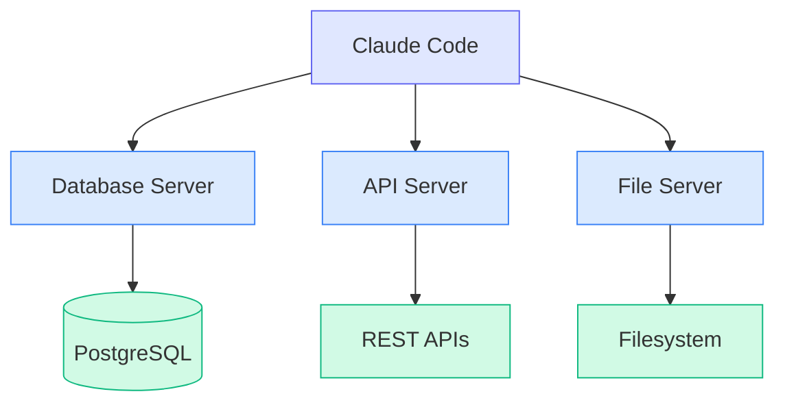

# Advanced MCP Patterns

Production-ready patterns for building robust, scalable MCP integrations.

## Server Composition

### Multi-Server Architecture

Run multiple specialized servers that work together:



Configuration:

```json
{
  "mcpServers": {
    "database": {
      "command": "npx",
      "args": ["-y", "@company/mcp-database"],
      "env": { "DATABASE_URL": "${DATABASE_URL}" }
    },
    "api": {
      "command": "npx",
      "args": ["-y", "@company/mcp-api"],
      "env": { "API_KEY": "${API_KEY}" }
    },
    "files": {
      "command": "npx",
      "args": ["-y", "@anthropic-ai/mcp-server-filesystem", "./data"]
    }
  }
}
```

### Server Aggregator Pattern

Create a meta-server that coordinates multiple backends:

```typescript
import { Server } from "@modelcontextprotocol/sdk/server/index.js";
import { StdioServerTransport } from "@modelcontextprotocol/sdk/server/stdio.js";
import {
  CallToolRequestSchema,
  ListToolsRequestSchema,
} from "@modelcontextprotocol/sdk/types.js";

interface Backend {
  name: string;
  healthCheck: () => Promise<boolean>;
  query: (params: object) => Promise<object>;
}

class AggregatorServer {
  private server: Server;
  private backends: Map<string, Backend> = new Map();

  constructor() {
    this.server = new Server(
      { name: "aggregator", version: "1.0.0" },
      { capabilities: { tools: {} } }
    );

    this.setupHandlers();
  }

  registerBackend(backend: Backend) {
    this.backends.set(backend.name, backend);
  }

  private setupHandlers() {
    // Dynamically list tools from all backends
    this.server.setRequestHandler(ListToolsRequestSchema, async () => {
      const tools = [];

      for (const [name, backend] of this.backends) {
        const healthy = await backend.healthCheck();
        if (healthy) {
          tools.push({
            name: `${name}_query`,
            description: `Query the ${name} backend`,
            inputSchema: {
              type: "object",
              properties: {
                query: { type: "string" },
                params: { type: "object" },
              },
              required: ["query"],
            },
          });
        }
      }

      return { tools };
    });

    // Route tool calls to appropriate backend
    this.server.setRequestHandler(CallToolRequestSchema, async (request) => {
      const { name, arguments: args } = request.params;
      const [backendName] = name.split("_");
      const backend = this.backends.get(backendName);

      if (!backend) {
        throw new Error(`Backend not found: ${backendName}`);
      }

      const result = await backend.query(args as object);
      return {
        content: [{ type: "text", text: JSON.stringify(result, null, 2) }],
      };
    });
  }

  async start() {
    const transport = new StdioServerTransport();
    await this.server.connect(transport);
  }
}

// Usage
const aggregator = new AggregatorServer();

aggregator.registerBackend({
  name: "postgres",
  healthCheck: async () => {
    // Check database connection
    return true;
  },
  query: async (params) => {
    // Execute query
    return { rows: [] };
  },
});

aggregator.registerBackend({
  name: "redis",
  healthCheck: async () => true,
  query: async (params) => {
    // Execute Redis command
    return { result: "OK" };
  },
});

aggregator.start();
```

## Caching Strategies

### In-Memory Cache

```typescript
import { LRUCache } from "lru-cache";

interface CacheEntry {
  data: unknown;
  timestamp: number;
}

class CachedServer {
  private cache: LRUCache<string, CacheEntry>;
  private defaultTTL: number;

  constructor(options: { maxSize?: number; ttlMs?: number } = {}) {
    this.defaultTTL = options.ttlMs ?? 60000; // 1 minute
    this.cache = new LRUCache({
      max: options.maxSize ?? 1000,
      ttl: this.defaultTTL,
    });
  }

  private getCacheKey(tool: string, args: object): string {
    return `${tool}:${JSON.stringify(args)}`;
  }

  async cachedCall<T>(
    tool: string,
    args: object,
    fetcher: () => Promise<T>,
    ttl?: number
  ): Promise<T> {
    const key = this.getCacheKey(tool, args);

    // Check cache
    const cached = this.cache.get(key);
    if (cached) {
      console.error(`Cache hit: ${key}`);
      return cached.data as T;
    }

    // Fetch and cache
    console.error(`Cache miss: ${key}`);
    const data = await fetcher();
    this.cache.set(key, { data, timestamp: Date.now() }, { ttl });

    return data;
  }

  invalidate(pattern?: string) {
    if (!pattern) {
      this.cache.clear();
      return;
    }

    // Invalidate matching keys
    for (const key of this.cache.keys()) {
      if (key.includes(pattern)) {
        this.cache.delete(key);
      }
    }
  }
}

// Usage in tool handler
const cachedServer = new CachedServer({ maxSize: 500, ttlMs: 300000 });

server.setRequestHandler(CallToolRequestSchema, async (request) => {
  const { name, arguments: args } = request.params;

  if (name === "get_user") {
    const result = await cachedServer.cachedCall(
      name,
      args as object,
      async () => {
        // Expensive database query
        return await db.query("SELECT * FROM users WHERE id = $1", [
          (args as { id: string }).id,
        ]);
      },
      60000 // Cache for 1 minute
    );

    return { content: [{ type: "text", text: JSON.stringify(result) }] };
  }

  // Invalidate cache on writes
  if (name === "update_user") {
    cachedServer.invalidate("get_user");
    // ... perform update
  }
});
```

### Distributed Cache with Redis

```typescript
import { createClient, RedisClientType } from "redis";

class RedisCacheLayer {
  private client: RedisClientType;
  private prefix: string;

  constructor(url: string, prefix = "mcp:") {
    this.prefix = prefix;
    this.client = createClient({ url });
  }

  async connect() {
    await this.client.connect();
  }

  async get<T>(key: string): Promise<T | null> {
    const data = await this.client.get(this.prefix + key);
    return data ? JSON.parse(data) : null;
  }

  async set(key: string, value: unknown, ttlSeconds = 300) {
    await this.client.setEx(
      this.prefix + key,
      ttlSeconds,
      JSON.stringify(value)
    );
  }

  async invalidatePattern(pattern: string) {
    const keys = await this.client.keys(this.prefix + pattern);
    if (keys.length > 0) {
      await this.client.del(keys);
    }
  }

  async disconnect() {
    await this.client.quit();
  }
}

// Usage
const cache = new RedisCacheLayer(process.env.REDIS_URL!);
await cache.connect();

async function handleQuery(sql: string): Promise<object> {
  const cacheKey = `query:${Buffer.from(sql).toString("base64")}`;

  // Try cache first
  const cached = await cache.get<object>(cacheKey);
  if (cached) return cached;

  // Execute query
  const result = await db.query(sql);

  // Cache for 5 minutes
  await cache.set(cacheKey, result, 300);

  return result;
}
```

## Rate Limiting

### Token Bucket Algorithm

```typescript
class TokenBucket {
  private tokens: number;
  private lastRefill: number;
  private readonly capacity: number;
  private readonly refillRate: number; // tokens per second

  constructor(capacity: number, refillRate: number) {
    this.capacity = capacity;
    this.refillRate = refillRate;
    this.tokens = capacity;
    this.lastRefill = Date.now();
  }

  private refill() {
    const now = Date.now();
    const elapsed = (now - this.lastRefill) / 1000;
    this.tokens = Math.min(this.capacity, this.tokens + elapsed * this.refillRate);
    this.lastRefill = now;
  }

  tryConsume(tokens = 1): boolean {
    this.refill();
    if (this.tokens >= tokens) {
      this.tokens -= tokens;
      return true;
    }
    return false;
  }

  async waitForTokens(tokens = 1): Promise<void> {
    while (!this.tryConsume(tokens)) {
      await new Promise((resolve) => setTimeout(resolve, 100));
    }
  }
}

class RateLimitedServer {
  private limiters: Map<string, TokenBucket> = new Map();
  private defaultLimit: { capacity: number; refillRate: number };

  constructor(defaultLimit = { capacity: 10, refillRate: 1 }) {
    this.defaultLimit = defaultLimit;
  }

  private getLimiter(key: string): TokenBucket {
    let limiter = this.limiters.get(key);
    if (!limiter) {
      limiter = new TokenBucket(
        this.defaultLimit.capacity,
        this.defaultLimit.refillRate
      );
      this.limiters.set(key, limiter);
    }
    return limiter;
  }

  async checkLimit(identifier: string): Promise<boolean> {
    const limiter = this.getLimiter(identifier);
    return limiter.tryConsume();
  }

  async waitForLimit(identifier: string): Promise<void> {
    const limiter = this.getLimiter(identifier);
    await limiter.waitForTokens();
  }
}

// Usage
const rateLimiter = new RateLimitedServer({ capacity: 100, refillRate: 10 });

server.setRequestHandler(CallToolRequestSchema, async (request) => {
  const toolName = request.params.name;

  // Check rate limit
  if (!await rateLimiter.checkLimit(toolName)) {
    return {
      content: [{ type: "text", text: "Rate limit exceeded. Please wait." }],
      isError: true,
    };
  }

  // Process request
  return await handleTool(request);
});
```

### Per-Tool Rate Limits

```typescript
interface RateLimitConfig {
  requestsPerMinute: number;
  burstLimit: number;
}

const TOOL_LIMITS: Record<string, RateLimitConfig> = {
  query_database: { requestsPerMinute: 60, burstLimit: 10 },
  send_email: { requestsPerMinute: 10, burstLimit: 2 },
  fetch_url: { requestsPerMinute: 30, burstLimit: 5 },
  default: { requestsPerMinute: 100, burstLimit: 20 },
};

class PerToolRateLimiter {
  private limiters: Map<string, TokenBucket> = new Map();

  getLimiter(tool: string): TokenBucket {
    if (!this.limiters.has(tool)) {
      const config = TOOL_LIMITS[tool] ?? TOOL_LIMITS.default;
      this.limiters.set(
        tool,
        new TokenBucket(config.burstLimit, config.requestsPerMinute / 60)
      );
    }
    return this.limiters.get(tool)!;
  }

  async checkAndWait(tool: string): Promise<void> {
    const limiter = this.getLimiter(tool);
    await limiter.waitForTokens();
  }
}
```

## Connection Pooling

### Database Connection Pool

```typescript
import { Pool, PoolConfig, PoolClient } from "pg";

class DatabasePool {
  private pool: Pool;
  private activeConnections = 0;
  private maxConnections: number;

  constructor(config: PoolConfig) {
    this.maxConnections = config.max ?? 10;
    this.pool = new Pool({
      ...config,
      max: this.maxConnections,
      idleTimeoutMillis: 30000,
      connectionTimeoutMillis: 5000,
    });

    // Monitor pool events
    this.pool.on("connect", () => {
      this.activeConnections++;
      console.error(`DB connected. Active: ${this.activeConnections}`);
    });

    this.pool.on("remove", () => {
      this.activeConnections--;
      console.error(`DB disconnected. Active: ${this.activeConnections}`);
    });

    this.pool.on("error", (err) => {
      console.error("Pool error:", err);
    });
  }

  async query<T>(sql: string, params?: unknown[]): Promise<T[]> {
    const client = await this.pool.connect();
    try {
      const result = await client.query(sql, params);
      return result.rows as T[];
    } finally {
      client.release();
    }
  }

  async transaction<T>(
    callback: (client: PoolClient) => Promise<T>
  ): Promise<T> {
    const client = await this.pool.connect();
    try {
      await client.query("BEGIN");
      const result = await callback(client);
      await client.query("COMMIT");
      return result;
    } catch (error) {
      await client.query("ROLLBACK");
      throw error;
    } finally {
      client.release();
    }
  }

  getStats() {
    return {
      total: this.pool.totalCount,
      idle: this.pool.idleCount,
      waiting: this.pool.waitingCount,
    };
  }

  async shutdown() {
    await this.pool.end();
  }
}

// Usage
const db = new DatabasePool({
  connectionString: process.env.DATABASE_URL,
  max: 20,
});

server.setRequestHandler(CallToolRequestSchema, async (request) => {
  if (request.params.name === "db_query") {
    const { sql, params } = request.params.arguments as {
      sql: string;
      params?: unknown[];
    };

    const rows = await db.query(sql, params);
    return {
      content: [{ type: "text", text: JSON.stringify(rows, null, 2) }],
    };
  }

  if (request.params.name === "db_transaction") {
    const { queries } = request.params.arguments as {
      queries: { sql: string; params?: unknown[] }[];
    };

    const results = await db.transaction(async (client) => {
      const outputs = [];
      for (const q of queries) {
        const result = await client.query(q.sql, q.params);
        outputs.push(result.rows);
      }
      return outputs;
    });

    return {
      content: [{ type: "text", text: JSON.stringify(results, null, 2) }],
    };
  }
});
```

### HTTP Connection Pool

```typescript
import { Agent } from "undici";

class HttpPool {
  private agents: Map<string, Agent> = new Map();

  getAgent(baseUrl: string): Agent {
    const host = new URL(baseUrl).host;

    if (!this.agents.has(host)) {
      this.agents.set(
        host,
        new Agent({
          pipelining: 1,
          connections: 10,
          keepAliveTimeout: 30000,
          keepAliveMaxTimeout: 60000,
        })
      );
    }

    return this.agents.get(host)!;
  }

  async fetch(url: string, options: RequestInit = {}): Promise<Response> {
    const agent = this.getAgent(url);
    return fetch(url, {
      ...options,
      // @ts-ignore - dispatcher is valid but not in types
      dispatcher: agent,
    });
  }

  async close() {
    for (const agent of this.agents.values()) {
      await agent.close();
    }
    this.agents.clear();
  }
}
```

## Health Checks

### Comprehensive Health Check System

```typescript
interface HealthStatus {
  status: "healthy" | "degraded" | "unhealthy";
  checks: Record<string, CheckResult>;
  timestamp: string;
}

interface CheckResult {
  status: "pass" | "fail" | "warn";
  message?: string;
  latencyMs?: number;
}

class HealthChecker {
  private checks: Map<string, () => Promise<CheckResult>> = new Map();

  register(name: string, check: () => Promise<CheckResult>) {
    this.checks.set(name, check);
  }

  async runAll(): Promise<HealthStatus> {
    const results: Record<string, CheckResult> = {};
    let overallStatus: "healthy" | "degraded" | "unhealthy" = "healthy";

    for (const [name, check] of this.checks) {
      const start = Date.now();
      try {
        const result = await Promise.race([
          check(),
          new Promise<CheckResult>((_, reject) =>
            setTimeout(() => reject(new Error("Timeout")), 5000)
          ),
        ]);
        results[name] = { ...result, latencyMs: Date.now() - start };

        if (result.status === "fail") overallStatus = "unhealthy";
        else if (result.status === "warn" && overallStatus === "healthy") {
          overallStatus = "degraded";
        }
      } catch (error) {
        results[name] = {
          status: "fail",
          message: error instanceof Error ? error.message : "Unknown error",
          latencyMs: Date.now() - start,
        };
        overallStatus = "unhealthy";
      }
    }

    return {
      status: overallStatus,
      checks: results,
      timestamp: new Date().toISOString(),
    };
  }
}

// Setup health checks
const healthChecker = new HealthChecker();

// Database health
healthChecker.register("database", async () => {
  try {
    await db.query("SELECT 1");
    return { status: "pass" };
  } catch (error) {
    return {
      status: "fail",
      message: error instanceof Error ? error.message : "DB error",
    };
  }
});

// Redis health
healthChecker.register("redis", async () => {
  try {
    await redisClient.ping();
    return { status: "pass" };
  } catch {
    return { status: "fail", message: "Redis unreachable" };
  }
});

// External API health
healthChecker.register("external_api", async () => {
  try {
    const response = await fetch("https://api.example.com/health");
    if (response.ok) return { status: "pass" };
    return { status: "warn", message: `Status ${response.status}` };
  } catch {
    return { status: "fail", message: "API unreachable" };
  }
});

// Memory health
healthChecker.register("memory", async () => {
  const used = process.memoryUsage();
  const heapUsedMB = used.heapUsed / 1024 / 1024;
  const heapTotalMB = used.heapTotal / 1024 / 1024;
  const usage = heapUsedMB / heapTotalMB;

  if (usage > 0.9) {
    return { status: "fail", message: `Heap usage: ${(usage * 100).toFixed(1)}%` };
  }
  if (usage > 0.7) {
    return { status: "warn", message: `Heap usage: ${(usage * 100).toFixed(1)}%` };
  }
  return { status: "pass" };
});

// Expose health check as a tool
server.setRequestHandler(CallToolRequestSchema, async (request) => {
  if (request.params.name === "health_check") {
    const health = await healthChecker.runAll();
    return {
      content: [{ type: "text", text: JSON.stringify(health, null, 2) }],
    };
  }
});
```

### Liveness and Readiness Probes

```typescript
class ProbeServer {
  private ready = false;
  private alive = true;

  setReady(ready: boolean) {
    this.ready = ready;
  }

  setAlive(alive: boolean) {
    this.alive = alive;
  }

  // For Kubernetes-style probes
  async startProbeServer(port: number) {
    const http = await import("http");

    const server = http.createServer((req, res) => {
      if (req.url === "/healthz" || req.url === "/livez") {
        if (this.alive) {
          res.writeHead(200);
          res.end("OK");
        } else {
          res.writeHead(503);
          res.end("Not alive");
        }
      } else if (req.url === "/readyz") {
        if (this.ready) {
          res.writeHead(200);
          res.end("Ready");
        } else {
          res.writeHead(503);
          res.end("Not ready");
        }
      } else {
        res.writeHead(404);
        res.end("Not found");
      }
    });

    server.listen(port, () => {
      console.error(`Probe server listening on port ${port}`);
    });

    return server;
  }
}

// Usage
const probes = new ProbeServer();

// During initialization
probes.setReady(false);

// Initialize resources
await db.connect();
await cache.connect();

// Mark as ready
probes.setReady(true);

// Start probe server for container orchestration
await probes.startProbeServer(8080);
```

## Graceful Degradation

### Circuit Breaker Pattern

```typescript
enum CircuitState {
  CLOSED = "closed",
  OPEN = "open",
  HALF_OPEN = "half_open",
}

interface CircuitBreakerOptions {
  failureThreshold: number;
  recoveryTimeout: number;
  halfOpenRequests: number;
}

class CircuitBreaker {
  private state: CircuitState = CircuitState.CLOSED;
  private failures = 0;
  private lastFailure: number = 0;
  private halfOpenSuccesses = 0;
  private options: CircuitBreakerOptions;

  constructor(options: Partial<CircuitBreakerOptions> = {}) {
    this.options = {
      failureThreshold: options.failureThreshold ?? 5,
      recoveryTimeout: options.recoveryTimeout ?? 30000,
      halfOpenRequests: options.halfOpenRequests ?? 3,
    };
  }

  async execute<T>(operation: () => Promise<T>, fallback?: () => T): Promise<T> {
    // Check if circuit should transition from OPEN to HALF_OPEN
    if (this.state === CircuitState.OPEN) {
      if (Date.now() - this.lastFailure >= this.options.recoveryTimeout) {
        this.state = CircuitState.HALF_OPEN;
        this.halfOpenSuccesses = 0;
        console.error("Circuit breaker: OPEN -> HALF_OPEN");
      } else {
        // Circuit is open, use fallback
        if (fallback) return fallback();
        throw new Error("Circuit breaker is open");
      }
    }

    try {
      const result = await operation();

      // Success handling
      if (this.state === CircuitState.HALF_OPEN) {
        this.halfOpenSuccesses++;
        if (this.halfOpenSuccesses >= this.options.halfOpenRequests) {
          this.state = CircuitState.CLOSED;
          this.failures = 0;
          console.error("Circuit breaker: HALF_OPEN -> CLOSED");
        }
      } else {
        this.failures = 0;
      }

      return result;
    } catch (error) {
      this.failures++;
      this.lastFailure = Date.now();

      if (this.state === CircuitState.HALF_OPEN) {
        // Failure in half-open state, go back to open
        this.state = CircuitState.OPEN;
        console.error("Circuit breaker: HALF_OPEN -> OPEN");
      } else if (this.failures >= this.options.failureThreshold) {
        // Too many failures, open the circuit
        this.state = CircuitState.OPEN;
        console.error("Circuit breaker: CLOSED -> OPEN");
      }

      if (fallback) return fallback();
      throw error;
    }
  }

  getState(): CircuitState {
    return this.state;
  }
}

// Usage per external service
const circuits = new Map<string, CircuitBreaker>();

function getCircuit(service: string): CircuitBreaker {
  if (!circuits.has(service)) {
    circuits.set(service, new CircuitBreaker());
  }
  return circuits.get(service)!;
}

server.setRequestHandler(CallToolRequestSchema, async (request) => {
  if (request.params.name === "call_external_api") {
    const { service, endpoint } = request.params.arguments as {
      service: string;
      endpoint: string;
    };

    const circuit = getCircuit(service);

    const result = await circuit.execute(
      async () => {
        const response = await fetch(`https://${service}.api.com${endpoint}`);
        if (!response.ok) throw new Error(`HTTP ${response.status}`);
        return response.json();
      },
      () => ({
        error: "Service temporarily unavailable",
        cached: true,
        // Return cached or default data
      })
    );

    return {
      content: [{ type: "text", text: JSON.stringify(result, null, 2) }],
    };
  }
});
```

### Fallback Strategies

```typescript
interface FallbackChain<T> {
  primary: () => Promise<T>;
  fallbacks: Array<{
    name: string;
    handler: () => Promise<T>;
    condition?: (error: Error) => boolean;
  }>;
  default: T;
}

async function executeWithFallbacks<T>(chain: FallbackChain<T>): Promise<{
  result: T;
  source: string;
}> {
  // Try primary
  try {
    const result = await chain.primary();
    return { result, source: "primary" };
  } catch (primaryError) {
    console.error("Primary failed:", primaryError);

    // Try fallbacks in order
    for (const fallback of chain.fallbacks) {
      // Check condition if specified
      if (
        fallback.condition &&
        !fallback.condition(primaryError as Error)
      ) {
        continue;
      }

      try {
        const result = await fallback.handler();
        return { result, source: fallback.name };
      } catch (fallbackError) {
        console.error(`Fallback ${fallback.name} failed:`, fallbackError);
      }
    }

    // All fallbacks failed, return default
    return { result: chain.default, source: "default" };
  }
}

// Usage
server.setRequestHandler(CallToolRequestSchema, async (request) => {
  if (request.params.name === "get_user_data") {
    const { userId } = request.params.arguments as { userId: string };

    const { result, source } = await executeWithFallbacks({
      primary: async () => {
        // Try primary database
        return await primaryDb.query("SELECT * FROM users WHERE id = $1", [userId]);
      },
      fallbacks: [
        {
          name: "replica",
          handler: async () => {
            // Try read replica
            return await replicaDb.query("SELECT * FROM users WHERE id = $1", [userId]);
          },
        },
        {
          name: "cache",
          handler: async () => {
            // Try cache
            const cached = await cache.get(`user:${userId}`);
            if (!cached) throw new Error("Cache miss");
            return cached;
          },
        },
      ],
      default: { id: userId, name: "Unknown", status: "unavailable" },
    });

    return {
      content: [
        {
          type: "text",
          text: JSON.stringify({ data: result, source }, null, 2),
        },
      ],
    };
  }
});
```

## Security Hardening

### Input Validation

```typescript
import { z } from "zod";

// Define strict schemas
const SqlQuerySchema = z.object({
  query: z
    .string()
    .max(10000)
    .refine(
      (q) => {
        const lower = q.toLowerCase();
        // Block dangerous operations
        const blocked = ["drop", "truncate", "delete", "update", "insert", "alter"];
        return !blocked.some((b) => lower.includes(b));
      },
      { message: "Query contains blocked operation" }
    ),
  params: z.array(z.unknown()).max(100).optional(),
});

const FilePathSchema = z
  .string()
  .max(500)
  .refine(
    (p) => {
      // Block path traversal
      return !p.includes("..") && !p.startsWith("/");
    },
    { message: "Invalid path" }
  );

const UrlSchema = z
  .string()
  .url()
  .refine(
    (u) => {
      const url = new URL(u);
      // Only allow HTTPS
      if (url.protocol !== "https:") return false;
      // Block internal networks
      const blocked = ["localhost", "127.0.0.1", "0.0.0.0", "169.254"];
      return !blocked.some((b) => url.hostname.includes(b));
    },
    { message: "Invalid or blocked URL" }
  );

// Validation middleware
function validateInput<T>(schema: z.ZodSchema<T>, input: unknown): T {
  const result = schema.safeParse(input);
  if (!result.success) {
    throw new McpError(
      ErrorCode.InvalidParams,
      `Validation failed: ${result.error.message}`
    );
  }
  return result.data;
}
```

### Secrets Management

```typescript
import { SecretManagerServiceClient } from "@google-cloud/secret-manager";

class SecretsManager {
  private client: SecretManagerServiceClient;
  private cache: Map<string, { value: string; expiry: number }> = new Map();
  private cacheTTL = 300000; // 5 minutes

  constructor() {
    this.client = new SecretManagerServiceClient();
  }

  async getSecret(name: string): Promise<string> {
    // Check cache
    const cached = this.cache.get(name);
    if (cached && cached.expiry > Date.now()) {
      return cached.value;
    }

    // Fetch from secret manager
    const [version] = await this.client.accessSecretVersion({
      name: `projects/${process.env.GCP_PROJECT}/secrets/${name}/versions/latest`,
    });

    const value = version.payload?.data?.toString() ?? "";

    // Cache the secret
    this.cache.set(name, {
      value,
      expiry: Date.now() + this.cacheTTL,
    });

    return value;
  }

  clearCache() {
    this.cache.clear();
  }
}

// Usage
const secrets = new SecretsManager();

async function getDatabaseUrl(): Promise<string> {
  return await secrets.getSecret("database-url");
}
```

### Audit Logging

```typescript
interface AuditLog {
  timestamp: string;
  tool: string;
  arguments: object;
  result: "success" | "error";
  error?: string;
  duration: number;
  metadata?: Record<string, unknown>;
}

class AuditLogger {
  private logs: AuditLog[] = [];
  private maxLogs = 10000;

  log(entry: Omit<AuditLog, "timestamp">) {
    const log: AuditLog = {
      ...entry,
      timestamp: new Date().toISOString(),
    };

    this.logs.push(log);

    // Rotate logs
    if (this.logs.length > this.maxLogs) {
      this.logs = this.logs.slice(-this.maxLogs / 2);
    }

    // Also send to external logging service
    this.sendToExternalLogger(log);
  }

  private async sendToExternalLogger(log: AuditLog) {
    // Send to your logging service (e.g., CloudWatch, Datadog)
    console.error(JSON.stringify(log));
  }

  getRecentLogs(count = 100): AuditLog[] {
    return this.logs.slice(-count);
  }

  search(filter: Partial<AuditLog>): AuditLog[] {
    return this.logs.filter((log) =>
      Object.entries(filter).every(([key, value]) => log[key as keyof AuditLog] === value)
    );
  }
}

const auditLogger = new AuditLogger();

// Wrap all tool calls with audit logging
server.setRequestHandler(CallToolRequestSchema, async (request) => {
  const start = Date.now();
  const { name, arguments: args } = request.params;

  try {
    const result = await handleTool(request);

    auditLogger.log({
      tool: name,
      arguments: args as object,
      result: "success",
      duration: Date.now() - start,
    });

    return result;
  } catch (error) {
    auditLogger.log({
      tool: name,
      arguments: args as object,
      result: "error",
      error: error instanceof Error ? error.message : "Unknown error",
      duration: Date.now() - start,
    });

    throw error;
  }
});
```

### Request Signing

```typescript
import * as crypto from "crypto";

class RequestSigner {
  private secretKey: string;

  constructor(secretKey: string) {
    this.secretKey = secretKey;
  }

  sign(payload: object, timestamp: number): string {
    const message = `${timestamp}.${JSON.stringify(payload)}`;
    return crypto
      .createHmac("sha256", this.secretKey)
      .update(message)
      .digest("hex");
  }

  verify(
    payload: object,
    timestamp: number,
    signature: string,
    maxAge = 300000
  ): boolean {
    // Check timestamp freshness
    if (Math.abs(Date.now() - timestamp) > maxAge) {
      return false;
    }

    // Verify signature
    const expected = this.sign(payload, timestamp);
    return crypto.timingSafeEqual(
      Buffer.from(signature),
      Buffer.from(expected)
    );
  }
}

// For servers that need to verify requests
const signer = new RequestSigner(process.env.SIGNING_KEY!);

server.setRequestHandler(CallToolRequestSchema, async (request) => {
  const { name, arguments: args } = request.params;
  const meta = args as { _timestamp?: number; _signature?: string };

  if (meta._timestamp && meta._signature) {
    const payload = { ...args };
    delete (payload as Record<string, unknown>)._timestamp;
    delete (payload as Record<string, unknown>)._signature;

    if (!signer.verify(payload, meta._timestamp, meta._signature)) {
      throw new McpError(ErrorCode.InvalidRequest, "Invalid signature");
    }
  }

  return await handleTool(request);
});
```

## Monitoring and Observability

### Metrics Collection

```typescript
class MetricsCollector {
  private counters: Map<string, number> = new Map();
  private histograms: Map<string, number[]> = new Map();
  private gauges: Map<string, number> = new Map();

  incrementCounter(name: string, value = 1) {
    const current = this.counters.get(name) ?? 0;
    this.counters.set(name, current + value);
  }

  recordHistogram(name: string, value: number) {
    const values = this.histograms.get(name) ?? [];
    values.push(value);
    // Keep last 1000 values
    if (values.length > 1000) values.shift();
    this.histograms.set(name, values);
  }

  setGauge(name: string, value: number) {
    this.gauges.set(name, value);
  }

  getMetrics(): object {
    const metrics: Record<string, unknown> = {};

    // Counters
    for (const [name, value] of this.counters) {
      metrics[`counter_${name}`] = value;
    }

    // Histograms - calculate percentiles
    for (const [name, values] of this.histograms) {
      if (values.length === 0) continue;
      const sorted = [...values].sort((a, b) => a - b);
      metrics[`histogram_${name}`] = {
        count: values.length,
        min: sorted[0],
        max: sorted[sorted.length - 1],
        avg: values.reduce((a, b) => a + b, 0) / values.length,
        p50: sorted[Math.floor(sorted.length * 0.5)],
        p95: sorted[Math.floor(sorted.length * 0.95)],
        p99: sorted[Math.floor(sorted.length * 0.99)],
      };
    }

    // Gauges
    for (const [name, value] of this.gauges) {
      metrics[`gauge_${name}`] = value;
    }

    return metrics;
  }
}

const metrics = new MetricsCollector();

// Track tool calls
server.setRequestHandler(CallToolRequestSchema, async (request) => {
  const start = Date.now();
  const tool = request.params.name;

  metrics.incrementCounter(`tool_calls_${tool}`);
  metrics.incrementCounter("tool_calls_total");

  try {
    const result = await handleTool(request);
    metrics.incrementCounter(`tool_success_${tool}`);
    return result;
  } catch (error) {
    metrics.incrementCounter(`tool_errors_${tool}`);
    throw error;
  } finally {
    metrics.recordHistogram(`tool_duration_${tool}`, Date.now() - start);
  }
});

// Expose metrics tool
server.setRequestHandler(ListToolsRequestSchema, async () => ({
  tools: [
    {
      name: "get_metrics",
      description: "Get server metrics",
      inputSchema: { type: "object", properties: {} },
    },
  ],
}));
```

## Best Practices Summary

1. **Server Composition** - Use specialized servers that work together
2. **Caching** - Implement appropriate caching for expensive operations
3. **Rate Limiting** - Protect resources with token bucket or similar algorithms
4. **Connection Pooling** - Reuse database and HTTP connections
5. **Health Checks** - Implement comprehensive health monitoring
6. **Graceful Degradation** - Use circuit breakers and fallback strategies
7. **Security Hardening** - Validate inputs, manage secrets, audit logs
8. **Monitoring** - Collect metrics for observability

## Next Steps

- [MCP Recipes](/mcp/recipes)
- [Building Servers](/mcp/building-servers)
- [MCP Configuration](/mcp/configuration)
