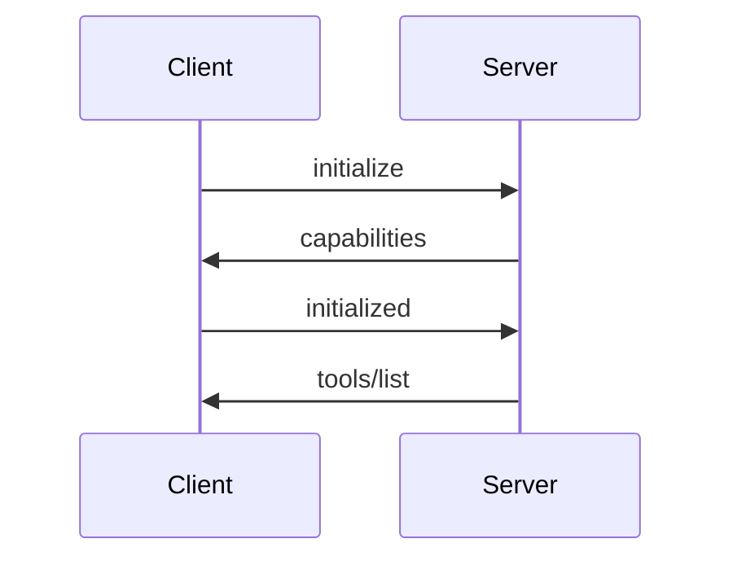
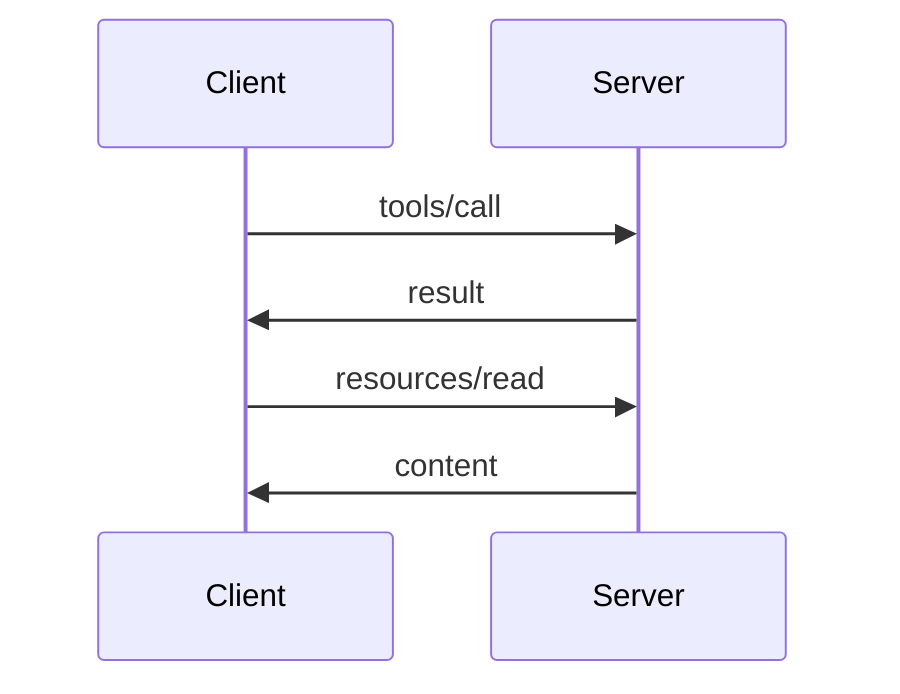

# MCP Architecture

Understanding the Model Context Protocol architecture helps you configure, debug, and build MCP integrations.

## Protocol Design

MCP is inspired by the Language Server Protocol (LSP), using similar patterns for AI-tool communication.

### Communication Flow

```
1. Client discovers servers from configuration
2. Client spawns server processes
3. Client/Server exchange capabilities
4. Client sends requests as needed
5. Server responds with results
6. Connection maintained for session
```

### Transport Layer

MCP supports multiple transports:

| Transport | Use Case |
|-----------|----------|
| **stdio** | Local processes (most common) |
| **HTTP** | Remote servers |
| **WebSocket** | Real-time connections |

### Message Format

All messages use JSON-RPC 2.0:

```json
// Request
{
  "jsonrpc": "2.0",
  "id": 1,
  "method": "tools/call",
  "params": {
    "name": "query",
    "arguments": {"sql": "SELECT 1"}
  }
}

// Response
{
  "jsonrpc": "2.0",
  "id": 1,
  "result": {
    "content": [{"type": "text", "text": "1"}]
  }
}
```

## Capabilities

### Server Capabilities

Servers declare their capabilities during initialization:

```json
{
  "capabilities": {
    "tools": {"listChanged": true},
    "resources": {"subscribe": true},
    "prompts": {}
  }
}
```

### Client Capabilities

Claude Code declares what it supports:

```json
{
  "capabilities": {
    "roots": {"listChanged": true},
    "sampling": {}
  }
}
```

## Lifecycle

### Initialization



### Normal Operation



### Shutdown

```
     │ ──── shutdown ────────────► │
     │                             │
     │ ◄─── ack ─────────────────  │
     │                             │
     │ ──── exit ────────────────► │
```

## Security Model

### Process Isolation

Each MCP server runs as a separate process:
- Sandboxed from Claude Code
- Limited filesystem access
- Network restrictions possible

### Permission Model

Claude Code mediates all MCP interactions:

```
User Request → Claude Code → Permission Check → MCP Server
```

### Environment Variables

Sensitive values passed via environment:

```json
{
  "mcpServers": {
    "github": {
      "command": "npx",
      "args": ["@anthropic-ai/mcp-server-github"],
      "env": {
        "GITHUB_TOKEN": "${GITHUB_TOKEN}"
      }
    }
  }
}
```

## Error Handling

### Error Codes

| Code | Meaning |
|------|---------|
| -32700 | Parse error |
| -32600 | Invalid request |
| -32601 | Method not found |
| -32602 | Invalid params |
| -32603 | Internal error |
| -32000 to -32099 | Server errors |

### Retry Logic

Claude Code implements automatic retry for transient failures:
- Connection timeouts
- Rate limits
- Server restarts

## Debugging

### Enable Debug Mode

```bash
claude --mcp-debug
```

### Check Server Status

```bash
/config mcpServers
```

### Common Issues

| Issue | Solution |
|-------|----------|
| Server not starting | Check command and args |
| Permission denied | Verify file permissions |
| Timeout | Increase timeout in config |
| Missing env vars | Check environment setup |

## Building Servers

### SDK Options

- **TypeScript/JavaScript** - `@modelcontextprotocol/sdk`
- **Python** - `mcp-python`
- **Rust** - `mcp-rs`
- **Go** - `mcp-go`

### Minimal Server Example

```typescript
import { Server } from "@modelcontextprotocol/sdk/server";
import { StdioServerTransport } from "@modelcontextprotocol/sdk/server/stdio";

const server = new Server({
  name: "my-server",
  version: "1.0.0",
});

server.setRequestHandler("tools/list", async () => ({
  tools: [{
    name: "hello",
    description: "Say hello",
    inputSchema: { type: "object", properties: {} }
  }]
}));

const transport = new StdioServerTransport();
server.connect(transport);
```

## Next Steps

- [Browse available servers](/mcp/servers)
- [Configure servers](/mcp/configuration)
- [MCP Specification](https://modelcontextprotocol.io/specification)
