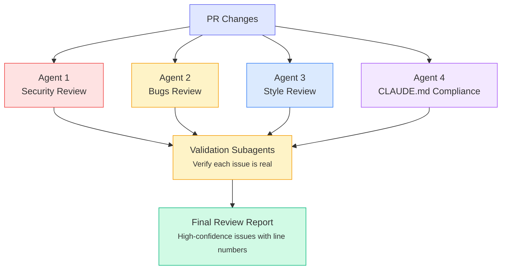

# Automated Code Review

Build an automated code review system that uses multiple Claude agents to catch bugs, security issues, and style problems.

**What you'll learn:**
- Setting up Claude's code review plugin
- Multi-agent review architecture
- GitHub Actions integration
- Custom review workflows

**Time:** 15 minutes

---

## How Multi-Agent Review Works

Claude Code's code review plugin uses a powerful multi-agent architecture:



---

## Quick Start: Local Review

### Run a Review

```bash
# Review current changes vs main branch
claude
> /code-review
```

### Review and Post to PR

```bash
# Post review as PR comment
> /code-review --comment
```

### Adjust Confidence Threshold

Only report issues above a confidence level (0-100):

```bash
# Only high-confidence issues
> /code-review --threshold 90

# Include more potential issues
> /code-review --threshold 70
```

---

## Setting Up the Code Review Plugin

### Step 1: Create the Command

```bash
mkdir -p .claude/commands
```

```markdown title=".claude/commands/code-review.md"
# Code Review

Review the changes in this PR/branch for issues.

## Review Categories

### 1. Security Issues
- Authentication/authorization bypasses
- Injection vulnerabilities (SQL, XSS, command)
- Sensitive data exposure
- Insecure dependencies

### 2. Bugs
- Logic errors
- Null/undefined handling
- Race conditions
- Resource leaks

### 3. Performance
- Inefficient algorithms
- Unnecessary re-renders (React)
- Missing indexes (database)
- Memory leaks

### 4. Code Quality
- Readability issues
- Duplicate code
- Missing error handling
- Poor naming

## Process

1. Get the diff: `git diff main...HEAD`
2. Launch 4 parallel agents, each focused on one category
3. For each issue found, spawn a validation subagent
4. Only report issues with >80% confidence
5. Include specific line numbers and fix suggestions

## Output Format

For each issue:
```
🔴 CRITICAL | Security | auth.js:42
SQL injection vulnerability in user query
Fix: Use parameterized queries instead of string concatenation
```
```

### Step 2: Use the Command

```bash
claude
> /code-review
```

---

## Bulk Review: Multiple PRs

### Review All Open PRs

```bash
#!/bin/bash
# review-all-prs.sh

# Get list of open PRs
prs=$(gh pr list --json number,headRefName --jq '.[].number')

for pr in $prs; do
  echo "Reviewing PR #$pr..."

  # Checkout PR locally
  gh pr checkout $pr

  # Run review
  review=$(claude -p "Review the changes in this PR:
$(git diff main...HEAD)

Look for bugs, security issues, and code quality problems.
Return a structured review with severity levels." --output-format text)

  # Post as comment
  gh pr comment $pr --body "$review"

  # Return to main
  git checkout main
done
```

### Review Changed Files Only

```bash
#!/bin/bash
# smart-review.sh

# Get changed files
changed=$(git diff --name-only main...HEAD | grep -E '\.(js|ts|py)$')

for file in $changed; do
  echo "Reviewing: $file"

  claude -p "Review this file for issues:

File: $file
$(cat $file)

Focus on:
1. New bugs introduced
2. Security vulnerabilities
3. Breaking changes

Be specific with line numbers." --output-format text
done
```

---

## GitHub Actions Integration

### Automatic PR Review

```yaml title=".github/workflows/claude-review.yml"
name: Claude Code Review

on:
  pull_request:
    types: [opened, synchronize]

jobs:
  review:
    runs-on: ubuntu-latest
    steps:
      - uses: actions/checkout@v4
        with:
          fetch-depth: 0  # Full history for diff

      - name: Setup Node.js
        uses: actions/setup-node@v4
        with:
          node-version: '20'

      - name: Install Claude Code
        run: npm install -g @anthropic-ai/claude-code

      - name: Run Code Review
        env:
          ANTHROPIC_API_KEY: ${{ secrets.ANTHROPIC_API_KEY }}
        run: |
          # Get the diff
          git diff origin/main...HEAD > pr_diff.txt

          # Run Claude review
          claude -p "Review this PR diff for bugs, security issues, and code quality:

          $(cat pr_diff.txt)

          Format as markdown with severity emojis:
          - 🔴 Critical
          - 🟡 Warning
          - 🟢 Suggestion" \
            --output-format text > review.md

      - name: Post Review Comment
        uses: actions/github-script@v7
        with:
          script: |
            const fs = require('fs');
            const review = fs.readFileSync('review.md', 'utf8');

            github.rest.issues.createComment({
              issue_number: context.issue.number,
              owner: context.repo.owner,
              repo: context.repo.repo,
              body: `## 🤖 Claude Code Review\n\n${review}`
            });
```

### Review with Quality Gate

Block merging if critical issues found:

```yaml title=".github/workflows/review-gate.yml"
name: Review Quality Gate

on:
  pull_request:
    types: [opened, synchronize]

jobs:
  review:
    runs-on: ubuntu-latest
    steps:
      - uses: actions/checkout@v4
        with:
          fetch-depth: 0

      - name: Install Claude Code
        run: npm install -g @anthropic-ai/claude-code

      - name: Run Security Review
        env:
          ANTHROPIC_API_KEY: ${{ secrets.ANTHROPIC_API_KEY }}
        run: |
          claude -p "Review for CRITICAL security issues only:
          $(git diff origin/main...HEAD)

          Return JSON: {\"critical_issues\": [...], \"passed\": true/false}" \
            --output-format json \
            --json-schema '{"type":"object","properties":{"critical_issues":{"type":"array"},"passed":{"type":"boolean"}},"required":["passed"]}' \
            > result.json

      - name: Check Results
        run: |
          passed=$(jq -r '.structured_output.passed' result.json)
          if [ "$passed" != "true" ]; then
            echo "❌ Critical issues found!"
            jq '.structured_output.critical_issues' result.json
            exit 1
          fi
          echo "✅ No critical issues found"
```

---

## Custom Review Agents

### Security-Focused Review

```markdown title=".claude/commands/security-review.md"
# Security Review

You are a security expert. Review @$ARGUMENTS for vulnerabilities.

## Checklist

### Injection
- [ ] SQL injection
- [ ] NoSQL injection
- [ ] Command injection
- [ ] LDAP injection
- [ ] XPath injection

### Authentication
- [ ] Weak password requirements
- [ ] Missing MFA considerations
- [ ] Session fixation
- [ ] Credential exposure

### Authorization
- [ ] Missing access controls
- [ ] IDOR vulnerabilities
- [ ] Privilege escalation paths

### Data Protection
- [ ] Sensitive data in logs
- [ ] Missing encryption
- [ ] Insecure transmission

## Output

For each finding:
1. Severity (Critical/High/Medium/Low)
2. Location (file:line)
3. Description
4. Proof of concept
5. Remediation
```

### Performance Review

```markdown title=".claude/commands/perf-review.md"
# Performance Review

Analyze @$ARGUMENTS for performance issues.

## Check For

### Algorithmic
- O(n²) or worse complexity where O(n) possible
- Unnecessary iterations
- Missing early returns

### Memory
- Memory leaks
- Large object retention
- Unbounded caches

### I/O
- N+1 queries
- Missing database indexes
- Synchronous blocking calls

### Frontend (if applicable)
- Unnecessary re-renders
- Large bundle imports
- Missing code splitting
- Unoptimized images

## Output Format

| Issue | Location | Impact | Fix |
|-------|----------|--------|-----|
| ...   | ...      | ...    | ... |
```

---

## Review Workflow Best Practices

### 1. Progressive Review

Start broad, then focus:

```bash
# Quick scan first
> /code-review --threshold 95

# Then detailed review
> /code-review --threshold 70
```

### 2. Category-Specific Reviews

```bash
# Security only
> /security-review

# Performance only
> /perf-review

# Style only
> /style-review
```

### 3. Review Before Commit

Add to your workflow:

```bash
# Pre-commit review
git diff --cached | claude -p "Quick review of staged changes. Any obvious issues?"
```

### 4. Historical Review

Review old code:

```bash
# Review a specific file's history
git log -p --follow src/auth.js | head -500 | claude -p "Summarize security-relevant changes"
```

---

## Interpreting Review Results

### Severity Levels

| Emoji | Level | Action |
|-------|-------|--------|
| 🔴 | Critical | Must fix before merge |
| 🟠 | High | Should fix before merge |
| 🟡 | Medium | Fix soon after merge |
| 🟢 | Low | Consider fixing |
| 💡 | Suggestion | Optional improvement |

### False Positives

If Claude flags something incorrectly:

```
> That's a false positive because [explanation]. Update your understanding.
```

Claude will learn from the feedback in the current session.

---

## Quick Reference

```bash
# Local review
/code-review

# Post to PR
/code-review --comment

# High confidence only
/code-review --threshold 90

# Specific file
/security-review src/auth.js

# Bulk review (headless)
claude -p "Review: $(git diff main...HEAD)" --output-format text

# JSON output for CI
claude -p "Review..." --output-format json --json-schema '{...}'
```

---

## Next Steps

1. **[Hooks & Automation](/tutorials/hooks-automation)** - Auto-review on file save
2. **[Headless CI/CD](/tutorials/headless-cicd)** - Full pipeline integration
3. **[Bulk Processing](/tutorials/bulk-processing)** - Review at scale
