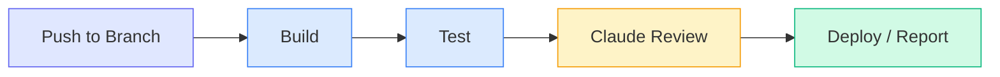

# Headless CI/CD Integration

Learn how to integrate Claude Code into GitHub Actions, GitLab CI, Jenkins, and other CI/CD systems for automated code review, testing, documentation, and more.

**What you'll learn:**
- Running Claude Code in CI/CD environments
- Setting up API keys securely
- Building practical CI workflows
- Output parsing and quality gates

**Time:** 20 minutes

---

## Why Use Claude in CI/CD?

Claude Code in your pipeline can:

- **Review PRs automatically** - Catch bugs before human review
- **Generate changelogs** - Create release notes from commits
- **Write missing tests** - Boost coverage automatically
- **Update documentation** - Keep docs in sync with code
- **Perform security audits** - Scan for vulnerabilities on every push



---

## Prerequisites

### 1. Get Your API Key

Generate an API key from the [Anthropic Console](https://console.anthropic.com/settings/keys).

### 2. Store as Secret

**GitHub Actions:**
```
Settings → Secrets and variables → Actions → New repository secret
Name: ANTHROPIC_API_KEY
Value: sk-ant-...
```

**GitLab CI:**
```
Settings → CI/CD → Variables
Key: ANTHROPIC_API_KEY
Value: sk-ant-...
Protected: Yes
Masked: Yes
```

**Jenkins:**
```groovy
credentials(credentialId: 'anthropic-api-key', variable: 'ANTHROPIC_API_KEY')
```

---

## GitHub Actions Workflows

### Basic PR Review

```yaml title=".github/workflows/claude-review.yml"
name: Claude Code Review

on:
  pull_request:
    types: [opened, synchronize]

jobs:
  review:
    runs-on: ubuntu-latest
    permissions:
      pull-requests: write
      contents: read

    steps:
      - uses: actions/checkout@v4
        with:
          fetch-depth: 0

      - name: Setup Node.js
        uses: actions/setup-node@v4
        with:
          node-version: '20'

      - name: Install Claude Code
        run: npm install -g @anthropic-ai/claude-code

      - name: Run Code Review
        env:
          ANTHROPIC_API_KEY: ${{ secrets.ANTHROPIC_API_KEY }}
        run: |
          # Get the diff
          git diff origin/${{ github.base_ref }}...HEAD > diff.txt

          # Run Claude review
          claude -p "Review this PR for bugs, security issues, and code quality:

          $(cat diff.txt)

          Format your review as:
          ## Summary
          Brief overview of changes

          ## Issues Found
          - 🔴 **Critical**: [description]
          - 🟡 **Warning**: [description]
          - 🟢 **Suggestion**: [description]

          ## Verdict
          APPROVE / REQUEST_CHANGES / COMMENT" \
            --output-format text > review.md

      - name: Post Review Comment
        uses: actions/github-script@v7
        with:
          script: |
            const fs = require('fs');
            const review = fs.readFileSync('review.md', 'utf8');

            await github.rest.issues.createComment({
              issue_number: context.issue.number,
              owner: context.repo.owner,
              repo: context.repo.repo,
              body: `## 🤖 Claude Code Review\n\n${review}`
            });
```

### Security Audit on Push

```yaml title=".github/workflows/security-audit.yml"
name: Security Audit

on:
  push:
    branches: [main, develop]
    paths:
      - 'src/**'
      - 'lib/**'

jobs:
  audit:
    runs-on: ubuntu-latest

    steps:
      - uses: actions/checkout@v4

      - name: Install Claude Code
        run: npm install -g @anthropic-ai/claude-code

      - name: Run Security Audit
        env:
          ANTHROPIC_API_KEY: ${{ secrets.ANTHROPIC_API_KEY }}
        run: |
          # Audit changed files
          for file in $(git diff --name-only HEAD~1 HEAD -- '*.js' '*.ts' '*.py'); do
            echo "Auditing: $file"
            claude -p "Security audit for $file:

            $(cat $file)

            Check for:
            1. SQL injection
            2. XSS vulnerabilities
            3. Authentication bypasses
            4. Sensitive data exposure
            5. Input validation issues

            Return JSON: {\"file\": \"$file\", \"issues\": [...], \"severity\": \"none|low|medium|high|critical\"}" \
              --output-format json >> audit-results.json
          done

      - name: Check for Critical Issues
        run: |
          if grep -q '"severity": "critical"' audit-results.json; then
            echo "❌ Critical security issues found!"
            cat audit-results.json
            exit 1
          fi
          echo "✅ No critical security issues"

      - name: Upload Audit Results
        uses: actions/upload-artifact@v4
        with:
          name: security-audit
          path: audit-results.json
```

### Auto-Generate Changelog

```yaml title=".github/workflows/changelog.yml"
name: Generate Changelog

on:
  release:
    types: [created]

jobs:
  changelog:
    runs-on: ubuntu-latest
    permissions:
      contents: write

    steps:
      - uses: actions/checkout@v4
        with:
          fetch-depth: 0

      - name: Install Claude Code
        run: npm install -g @anthropic-ai/claude-code

      - name: Generate Changelog
        env:
          ANTHROPIC_API_KEY: ${{ secrets.ANTHROPIC_API_KEY }}
        run: |
          # Get commits since last tag
          LAST_TAG=$(git describe --tags --abbrev=0 HEAD^ 2>/dev/null || echo "")
          if [ -n "$LAST_TAG" ]; then
            COMMITS=$(git log $LAST_TAG..HEAD --oneline)
          else
            COMMITS=$(git log --oneline -50)
          fi

          claude -p "Generate a changelog from these commits:

          $COMMITS

          Format as:
          ## What's New
          - Feature descriptions

          ## Bug Fixes
          - Bug fix descriptions

          ## Breaking Changes
          - Any breaking changes

          Write for end users, not developers." \
            --output-format text > CHANGELOG_NEW.md

      - name: Update Release Notes
        uses: actions/github-script@v7
        with:
          script: |
            const fs = require('fs');
            const changelog = fs.readFileSync('CHANGELOG_NEW.md', 'utf8');

            await github.rest.repos.updateRelease({
              owner: context.repo.owner,
              repo: context.repo.repo,
              release_id: context.payload.release.id,
              body: changelog
            });
```

### Quality Gate with Structured Output

```yaml title=".github/workflows/quality-gate.yml"
name: Quality Gate

on:
  pull_request:
    types: [opened, synchronize]

jobs:
  quality:
    runs-on: ubuntu-latest

    steps:
      - uses: actions/checkout@v4
        with:
          fetch-depth: 0

      - name: Install Claude Code
        run: npm install -g @anthropic-ai/claude-code

      - name: Run Quality Check
        env:
          ANTHROPIC_API_KEY: ${{ secrets.ANTHROPIC_API_KEY }}
        run: |
          claude -p "Analyze this PR for quality:

          $(git diff origin/main...HEAD)

          Evaluate:
          1. Code complexity (1-10)
          2. Test coverage likelihood (1-10)
          3. Documentation quality (1-10)
          4. Security score (1-10)
          5. Overall recommendation" \
            --output-format json \
            --json-schema '{
              "type": "object",
              "properties": {
                "complexity": {"type": "number"},
                "test_coverage": {"type": "number"},
                "documentation": {"type": "number"},
                "security": {"type": "number"},
                "recommendation": {"type": "string", "enum": ["approve", "request_changes", "needs_discussion"]},
                "summary": {"type": "string"}
              },
              "required": ["complexity", "test_coverage", "documentation", "security", "recommendation", "summary"]
            }' > quality.json

      - name: Evaluate Quality Gate
        run: |
          # Extract scores
          SECURITY=$(jq -r '.structured_output.security' quality.json)
          RECOMMENDATION=$(jq -r '.structured_output.recommendation' quality.json)
          SUMMARY=$(jq -r '.structured_output.summary' quality.json)

          echo "## Quality Report" >> $GITHUB_STEP_SUMMARY
          echo "" >> $GITHUB_STEP_SUMMARY
          cat quality.json | jq -r '.structured_output | to_entries | .[] | "- **\(.key)**: \(.value)"' >> $GITHUB_STEP_SUMMARY

          # Fail if security score too low
          if [ "$SECURITY" -lt 5 ]; then
            echo "❌ Security score too low: $SECURITY"
            exit 1
          fi

          # Fail if changes requested
          if [ "$RECOMMENDATION" = "request_changes" ]; then
            echo "❌ Changes requested: $SUMMARY"
            exit 1
          fi

          echo "✅ Quality gate passed"
```

---

## GitLab CI Configuration

```yaml title=".gitlab-ci.yml"
stages:
  - review
  - audit
  - deploy

variables:
  NODE_VERSION: "20"

.claude-setup: &claude-setup
  before_script:
    - npm install -g @anthropic-ai/claude-code

code-review:
  stage: review
  <<: *claude-setup
  script:
    - |
      git diff origin/$CI_MERGE_REQUEST_TARGET_BRANCH_NAME...HEAD > diff.txt
      claude -p "Review this merge request:

      $(cat diff.txt)

      Provide constructive feedback." \
        --output-format text > review.md
    - cat review.md
  artifacts:
    paths:
      - review.md
  rules:
    - if: $CI_PIPELINE_SOURCE == "merge_request_event"

security-audit:
  stage: audit
  <<: *claude-setup
  script:
    - |
      claude -p "Security audit for changed files:

      $(git diff --name-only HEAD~1 HEAD | xargs cat)

      Return JSON with issues found." \
        --output-format json > audit.json
    - |
      if grep -q '"severity": "critical"' audit.json; then
        echo "Critical issues found!"
        exit 1
      fi
  artifacts:
    paths:
      - audit.json
  rules:
    - if: $CI_COMMIT_BRANCH == "main"
```

---

## Jenkins Pipeline

```groovy title="Jenkinsfile"
pipeline {
    agent any

    environment {
        ANTHROPIC_API_KEY = credentials('anthropic-api-key')
    }

    stages {
        stage('Setup') {
            steps {
                sh 'npm install -g @anthropic-ai/claude-code'
            }
        }

        stage('Code Review') {
            when {
                changeRequest()
            }
            steps {
                script {
                    def diff = sh(script: 'git diff origin/main...HEAD', returnStdout: true)

                    def review = sh(script: """
                        claude -p "Review this PR:

                        ${diff}

                        Format as markdown." --output-format text
                    """, returnStdout: true)

                    // Post to PR (varies by SCM)
                    echo review
                }
            }
        }

        stage('Security Scan') {
            steps {
                sh '''
                    claude -p "Security scan:

                    $(find src -name "*.js" | head -20 | xargs cat)

                    Return JSON with findings." \
                      --output-format json > security.json
                '''

                script {
                    def results = readJSON file: 'security.json'
                    if (results.containsKey('critical_issues')) {
                        error "Critical security issues found!"
                    }
                }
            }
        }
    }

    post {
        always {
            archiveArtifacts artifacts: '*.json', allowEmptyArchive: true
        }
    }
}
```

---

## CircleCI Configuration

```yaml title=".circleci/config.yml"
version: 2.1

orbs:
  node: circleci/node@5.0

jobs:
  claude-review:
    docker:
      - image: cimg/node:20.0
    steps:
      - checkout
      - run:
          name: Install Claude Code
          command: npm install -g @anthropic-ai/claude-code
      - run:
          name: Run Review
          command: |
            claude -p "Review changes in this commit:

            $(git show --stat HEAD)
            $(git diff HEAD~1)

            Provide feedback." --output-format text > review.txt
      - store_artifacts:
          path: review.txt

workflows:
  review:
    jobs:
      - claude-review:
          context: anthropic-credentials
```

---

## Best Practices

### 1. Use Structured Output for Gates

```bash
# Always use JSON schema for quality gates
claude -p "Analyze..." \
  --output-format json \
  --json-schema '{"type":"object","properties":{"passed":{"type":"boolean"}},"required":["passed"]}'
```

### 2. Handle Rate Limits

```yaml
- name: Run with Retry
  uses: nick-fields/retry@v2
  with:
    timeout_minutes: 10
    max_attempts: 3
    retry_wait_seconds: 60
    command: claude -p "..."
```

### 3. Cache Node Modules

```yaml
- name: Cache npm
  uses: actions/cache@v3
  with:
    path: ~/.npm
    key: ${{ runner.os }}-node-${{ hashFiles('**/package-lock.json') }}
```

### 4. Limit Scope

```bash
# Only analyze changed files, not entire codebase
changed=$(git diff --name-only origin/main...HEAD -- '*.js' '*.ts')
for file in $changed; do
  claude -p "Review: $(cat $file)"
done
```

### 5. Set Timeouts

```yaml
- name: Claude Review
  timeout-minutes: 5
  run: claude -p "..." --output-format text
```

---

## Debugging CI Issues

### Enable Verbose Output

```bash
claude -p "..." --verbose 2>&1 | tee claude-output.log
```

### Check API Key

```yaml
- name: Verify API Key
  run: |
    if [ -z "$ANTHROPIC_API_KEY" ]; then
      echo "API key not set!"
      exit 1
    fi
    echo "API key is set (length: ${#ANTHROPIC_API_KEY})"
```

### Test Locally First

```bash
# Simulate CI environment
export ANTHROPIC_API_KEY="sk-ant-..."
git diff origin/main...HEAD | claude -p "Review this diff"
```

---

## Quick Reference

```yaml
# Install Claude Code
npm install -g @anthropic-ai/claude-code

# Run with prompt
claude -p "Your prompt" --output-format text

# JSON output
claude -p "Your prompt" --output-format json

# Structured output
claude -p "Your prompt" \
  --output-format json \
  --json-schema '{"type":"object","properties":{"result":{"type":"string"}}}'

# With tool permissions
claude -p "Your prompt" --allowedTools "Read,Bash(git:*)"

# Continue session
claude -p "Follow up" --continue
```

---

## Next Steps

1. **[Bulk Processing](/tutorials/bulk-processing)** - Scale up your CI workflows
2. **[Automated Code Review](/tutorials/automated-review)** - Deep dive into review patterns
3. **[Session Management](/tutorials/session-mastery)** - Optimize CI session usage
