# Hooks & Automation

Learn how to set up hooks that automatically run scripts when Claude Code performs actions, enabling auto-formatting, linting, notifications, and custom workflows.

**What you'll learn:**
- Understanding Claude Code hook system
- Setting up pre and post-action hooks
- Auto-formatting and linting on file changes
- Building notification workflows
- Real-world hook examples

**Time:** 15 minutes

---

## What Are Hooks?

Hooks are shell commands that run automatically when Claude Code performs specific actions. They let you:

- **Auto-format** code after Claude edits a file
- **Run linters** to catch issues immediately
- **Send notifications** when tasks complete
- **Log actions** for audit trails
- **Validate changes** before they're applied

```mermaid
flowchart TD
    A[Claude edits file.js] --> B
    B[Pre-Edit Hook<br/><small>• Validate permissions<br/>• Check file locks</small>] --> C
    C[Edit Applied] --> D
    D[Post-Edit Hook<br/><small>• Run Prettier<br/>• Run ESLint --fix<br/>• Notify Slack</small>]

    style A fill:#e0e7ff,stroke:#6366f1
    style B fill:#fef3c7,stroke:#f59e0b
    style C fill:#d1fae5,stroke:#10b981
    style D fill:#fef3c7,stroke:#f59e0b
```



---

## Setting Up Hooks

### Configuration Location

Hooks are configured in your Claude Code settings:

```bash
# Global hooks (all projects)
~/.claude/settings.json

# Project-specific hooks
.claude/settings.json
```

### Basic Hook Structure

```json title=".claude/settings.json"
{
  "hooks": {
    "postEdit": [
      {
        "matcher": "**/*.{js,ts,jsx,tsx}",
        "command": "npx prettier --write $FILE"
      }
    ]
  }
}
```

### Hook Types

| Hook | When It Runs |
|------|--------------|
| `preEdit` | Before Claude edits a file |
| `postEdit` | After Claude edits a file |
| `preBash` | Before Claude runs a bash command |
| `postBash` | After Claude runs a bash command |
| `preSession` | When a Claude session starts |
| `postSession` | When a Claude session ends |

---

## Your First Hook: Auto-Format

### Step 1: Install Prettier

```bash
npm install -D prettier
```

### Step 2: Configure the Hook

```json title=".claude/settings.json"
{
  "hooks": {
    "postEdit": [
      {
        "matcher": "**/*.{js,ts,jsx,tsx,json,css,md}",
        "command": "npx prettier --write \"$FILE\""
      }
    ]
  }
}
```

### Step 3: Test It

Ask Claude to edit any JavaScript file. After the edit, Prettier will automatically format it.

```
> Add a console.log to src/index.js
```

Claude edits the file → Prettier formats it → You see clean code.

---

## Auto-Linting Setup

### ESLint Auto-Fix

```json
{
  "hooks": {
    "postEdit": [
      {
        "matcher": "**/*.{js,ts,jsx,tsx}",
        "command": "npx eslint --fix \"$FILE\" || true"
      }
    ]
  }
}
```

The `|| true` prevents the hook from failing if ESLint finds unfixable issues.

### Python with Black and Ruff

```json
{
  "hooks": {
    "postEdit": [
      {
        "matcher": "**/*.py",
        "command": "black \"$FILE\" && ruff check --fix \"$FILE\""
      }
    ]
  }
}
```

### Go Format

```json
{
  "hooks": {
    "postEdit": [
      {
        "matcher": "**/*.go",
        "command": "gofmt -w \"$FILE\""
      }
    ]
  }
}
```

### Rust Format

```json
{
  "hooks": {
    "postEdit": [
      {
        "matcher": "**/*.rs",
        "command": "rustfmt \"$FILE\""
      }
    ]
  }
}
```

---

## Notification Hooks

### Slack Notification on Session End

```json
{
  "hooks": {
    "postSession": [
      {
        "command": "curl -X POST -H 'Content-type: application/json' --data '{\"text\":\"Claude session completed\"}' $SLACK_WEBHOOK_URL"
      }
    ]
  }
}
```

### Desktop Notification (macOS)

```json
{
  "hooks": {
    "postSession": [
      {
        "command": "osascript -e 'display notification \"Claude session completed\" with title \"Claude Code\"'"
      }
    ]
  }
}
```

### Desktop Notification (Linux)

```json
{
  "hooks": {
    "postSession": [
      {
        "command": "notify-send 'Claude Code' 'Session completed'"
      }
    ]
  }
}
```

### Log All Edits

```json
{
  "hooks": {
    "postEdit": [
      {
        "matcher": "**/*",
        "command": "echo \"$(date): Edited $FILE\" >> ~/.claude/edit-log.txt"
      }
    ]
  }
}
```

---

## Validation Hooks

### Prevent Editing Sensitive Files

```json
{
  "hooks": {
    "preEdit": [
      {
        "matcher": "**/.env*",
        "command": "echo 'Cannot edit .env files' && exit 1"
      },
      {
        "matcher": "**/credentials*",
        "command": "echo 'Cannot edit credential files' && exit 1"
      }
    ]
  }
}
```

### Type Check After Edit

```json
{
  "hooks": {
    "postEdit": [
      {
        "matcher": "**/*.{ts,tsx}",
        "command": "npx tsc --noEmit \"$FILE\" 2>&1 | head -20 || true"
      }
    ]
  }
}
```

### Run Tests After Edit

```json
{
  "hooks": {
    "postEdit": [
      {
        "matcher": "src/**/*.ts",
        "command": "npm test -- --findRelatedTests \"$FILE\" --passWithNoTests"
      }
    ]
  }
}
```

---

## Advanced Hook Patterns

### Chain Multiple Commands

```json
{
  "hooks": {
    "postEdit": [
      {
        "matcher": "**/*.ts",
        "command": "npx prettier --write \"$FILE\" && npx eslint --fix \"$FILE\" && npx tsc --noEmit"
      }
    ]
  }
}
```

### Conditional Hooks

```json
{
  "hooks": {
    "postEdit": [
      {
        "matcher": "**/*.ts",
        "command": "if [ -f tsconfig.json ]; then npx tsc --noEmit; fi"
      }
    ]
  }
}
```

### Different Hooks per Directory

```json
{
  "hooks": {
    "postEdit": [
      {
        "matcher": "frontend/**/*.{js,ts,jsx,tsx}",
        "command": "cd frontend && npm run lint:fix -- \"$FILE\""
      },
      {
        "matcher": "backend/**/*.py",
        "command": "cd backend && poetry run black \"$FILE\""
      }
    ]
  }
}
```

### Hook Scripts

For complex logic, use a script:

```bash title=".claude/hooks/post-edit.sh"
#!/bin/bash
FILE="$1"
EXTENSION="${FILE##*.}"

case "$EXTENSION" in
  js|ts|jsx|tsx)
    npx prettier --write "$FILE"
    npx eslint --fix "$FILE"
    ;;
  py)
    black "$FILE"
    ruff check --fix "$FILE"
    ;;
  go)
    gofmt -w "$FILE"
    ;;
esac
```

```json
{
  "hooks": {
    "postEdit": [
      {
        "matcher": "**/*",
        "command": ".claude/hooks/post-edit.sh \"$FILE\""
      }
    ]
  }
}
```

---

## Session Hooks

### Initialize Environment on Start

```json
{
  "hooks": {
    "preSession": [
      {
        "command": "echo 'Session started at $(date)' >> ~/.claude/sessions.log"
      },
      {
        "command": "npm install --silent 2>/dev/null || true"
      }
    ]
  }
}
```

### Cleanup on Exit

```json
{
  "hooks": {
    "postSession": [
      {
        "command": "git stash --include-untracked -m 'Auto-stash from Claude session'"
      }
    ]
  }
}
```

### Generate Summary on Exit

```json
{
  "hooks": {
    "postSession": [
      {
        "command": "git diff --stat HEAD~10..HEAD > session-summary.txt 2>/dev/null || true"
      }
    ]
  }
}
```

---

## Bash Command Hooks

### Log All Commands

```json
{
  "hooks": {
    "preBash": [
      {
        "command": "echo \"Running: $COMMAND\" >> ~/.claude/command-log.txt"
      }
    ]
  }
}
```

### Prevent Dangerous Commands

```json
{
  "hooks": {
    "preBash": [
      {
        "command": "if echo \"$COMMAND\" | grep -q 'rm -rf /'; then echo 'Blocked dangerous command' && exit 1; fi"
      }
    ]
  }
}
```

### Auto-Confirm Safe Commands

```json
{
  "hooks": {
    "preBash": [
      {
        "command": "if echo \"$COMMAND\" | grep -qE '^(npm test|npm run lint|git status)'; then exit 0; fi"
      }
    ]
  }
}
```

---

## Complete Configuration Example

```json title=".claude/settings.json"
{
  "hooks": {
    "preSession": [
      {
        "command": "echo '🚀 Claude session started' && npm install --silent 2>/dev/null || true"
      }
    ],
    "postSession": [
      {
        "command": "notify-send 'Claude Code' 'Session completed' 2>/dev/null || osascript -e 'display notification \"Session completed\" with title \"Claude Code\"' 2>/dev/null || true"
      }
    ],
    "preEdit": [
      {
        "matcher": "**/.env*",
        "command": "echo '⚠️  Cannot edit environment files' && exit 1"
      }
    ],
    "postEdit": [
      {
        "matcher": "**/*.{js,ts,jsx,tsx}",
        "command": "npx prettier --write \"$FILE\" && npx eslint --fix \"$FILE\" 2>/dev/null || true"
      },
      {
        "matcher": "**/*.py",
        "command": "black \"$FILE\" 2>/dev/null && ruff check --fix \"$FILE\" 2>/dev/null || true"
      },
      {
        "matcher": "**/*.{json,yaml,yml,md}",
        "command": "npx prettier --write \"$FILE\" 2>/dev/null || true"
      }
    ],
    "preBash": [
      {
        "command": "echo \"$(date '+%H:%M:%S') $COMMAND\" >> .claude/command-history.log"
      }
    ]
  }
}
```

---

## Troubleshooting

### Hook Not Running

1. Check the matcher pattern matches your file:
```bash
# Test glob pattern
npx glob "**/*.ts" --cwd .
```

2. Ensure the command exists:
```bash
which prettier
which eslint
```

3. Check hook syntax in settings.json:
```bash
cat .claude/settings.json | jq .
```

### Hook Fails Silently

Add error output to debug:

```json
{
  "command": "npx prettier --write \"$FILE\" 2>&1 || echo 'Prettier failed'"
}
```

### Hook Blocks Claude

If a preEdit hook exits with non-zero, the edit is blocked. Use `|| true` for non-critical hooks:

```json
{
  "command": "npm run lint \"$FILE\" || true"
}
```

---

## Quick Reference

```json
// Auto-format JavaScript/TypeScript
"postEdit": [{
  "matcher": "**/*.{js,ts,jsx,tsx}",
  "command": "npx prettier --write \"$FILE\""
}]

// Auto-format Python
"postEdit": [{
  "matcher": "**/*.py",
  "command": "black \"$FILE\""
}]

// Block sensitive file edits
"preEdit": [{
  "matcher": "**/.env*",
  "command": "exit 1"
}]

// Desktop notification
"postSession": [{
  "command": "notify-send 'Claude' 'Done'"
}]

// Log all edits
"postEdit": [{
  "matcher": "**/*",
  "command": "echo \"$FILE\" >> edit-log.txt"
}]
```

### Available Variables

| Variable | Description |
|----------|-------------|
| `$FILE` | Full path to the edited file |
| `$COMMAND` | The bash command being run (preBash/postBash) |

---

## Next Steps

1. **[Headless CI/CD](/tutorials/headless-cicd)** - Use hooks in automated pipelines
2. **[Custom Commands](/tutorials/custom-commands)** - Combine hooks with slash commands
3. **[Bulk Processing](/tutorials/bulk-processing)** - Apply hooks at scale
